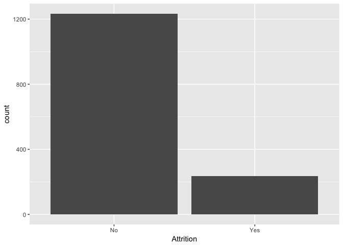
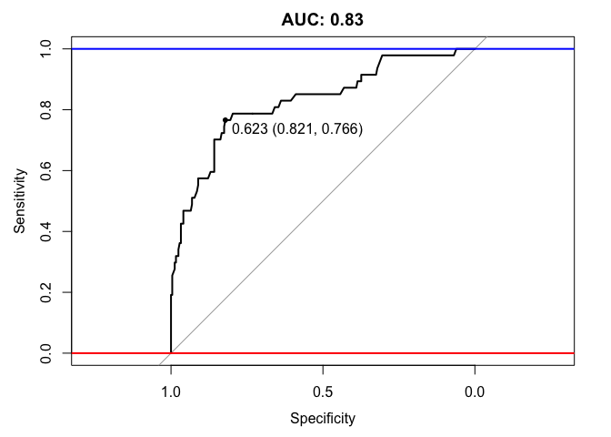
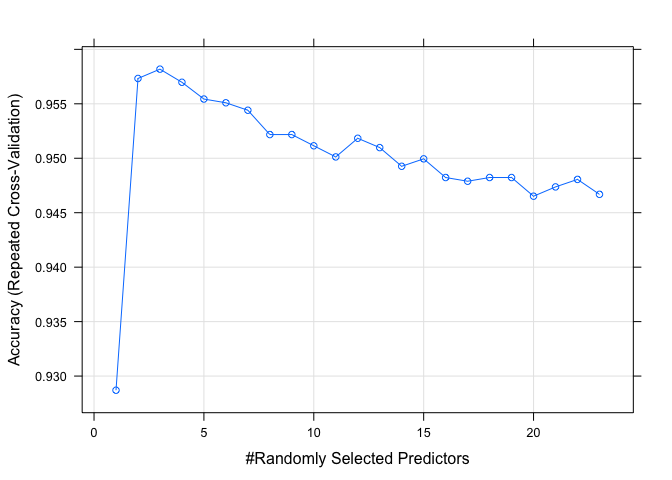
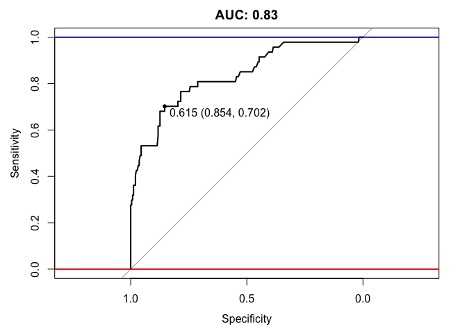
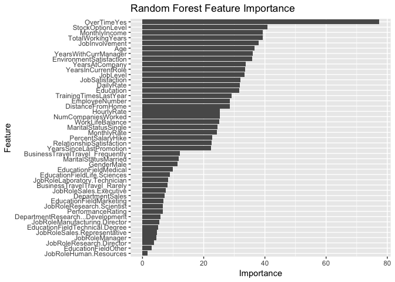
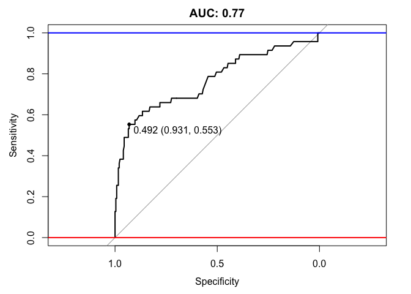

Introduction
------------

After our exploratory anlaysis, we got a sense of how correlated one
feature is to the other and created some visualisations. Based on that
result, we are going to build a predictive model on emplyee's attrition.
To start off, we will first construct some feature engineering.

    #can't do read_csv here, need be "dataframe" 
    data <- read.csv('IBM-HR-Employee-Attrition.csv')

Feature engineering & Categorical Encoding
------------------------------------------

Noticing that StandardHours, Over18, EmployeeCount has only 1 demension.
We deleted these redundant features.

    data<- data[-27]
    data <- data[-22]
    data <- data[-9]

Having identified which features contain categorical data in our
dataset, we encoded those categorical variables into numerical values
for further exploration. We used model.matrix method to creates encoded
dummy variables from the categorical variables.

    dummy <- model.matrix(Attrition ~ ., data)
    new <- data.frame(dummy) # change back to a datafram 
    new <- new[,-1] # get rid first useless columne
    Attrition <- data$Attrition
    dataDummy <- cbind(Attrition,new) #add Attrition back 
    head(dataDummy[,3:4])

    ##   BusinessTravelTravel_Frequently BusinessTravelTravel_Rarely
    ## 1                               0                           1
    ## 2                               1                           0
    ## 3                               0                           1
    ## 4                               1                           0
    ## 5                               0                           1
    ## 6                               1                           0

However after quick inspection of the counts of the number of 'Yes' and
'No' in the target variable(Attrition), we found that there is quite a
large skew in target as shown

    #check to find that the data is skewed 
    ggplot(dataDummy) + geom_histogram(aes (x = Attrition),stat = "count")

    ## Warning: Ignoring unknown parameters: binwidth, bins, pad

    prop.table(table(dataDummy$Attrition))

    ## 
    ##        No       Yes 
    ## 0.8387755 0.1612245

    table(dataDummy$Attrition)

    ## 
    ##   No  Yes 
    ## 1233  237

In this case we have to keep in mind that there is quite a big imbalance
in our target variable. And with imbalanced data sets, an algorithm
doesn’t get the necessary information about the minority class to make
an accurate prediction. In order to solve imbalanced data, we have
considered many techniques such as repeated oversampling and
undersampling. And we decided to use an oversampling technique known as
SMOTE to treat this imbalance, which will be performed in next section.

Implementing Models
-------------------

Having performed some exploratory data analysis and simple feature
engineering as well as having ensured that all categorical values are
encoded, we are now ready to proceed onto building our models.

### Splitting Data into Train and Test sets

Before we start training a model, we partitioned our dataset into a
training set and a test set with proportion 8:2.

    #split data into train and test 
    set.seed(1234)
    splitIndex <- createDataPartition(dataDummy$Attrition, p =0.8, list =FALSE, times =1)
    test <- dataDummy[-splitIndex,]
    train <- dataDummy[splitIndex,]

### SMOTE to oversample due to the skewness in target

Since we have already noted the severe imbalance in the values within
the target variable, we used SMOTE function to created some arbirary
data in minor class to make the whole categorical distribution in target
variable balanced. The SMOTE function oversamples your rare event by
using bootstrapping and k-nearest neighbor to synthetically create
additional observations of that event.

    #oversample train data to balance 
    trainBalance <- SMOTE(Attrition ~ ., train, perc.over = 400, perc.under=131)
    table(trainBalance$Attrition)

    ## 
    ##  No Yes 
    ## 995 950

    prop.table(table(trainBalance$Attrition))

    ## 
    ##        No       Yes 
    ## 0.5115681 0.4884319

We create some data in train set and now the proportion of "NO" "Yes" in
target variable changed from 0.84:0.16 to 0.51:0.49. We are ready to
build model based on this balanced data now.

Random Forest Classifier
------------------------

Since all interested in decidsion trees. We'll build an Random Forest
Classifier to predict employees' attrition without lossing any
variables. From Wikipedia, Random forests are an ensemble learning
method for classification, regression and other tasks, that operate by
constructing a multitude of decision trees at training time and
outputting the class that is the mode of the classes (classification) or
mean prediction (regression) of the individual trees. We will first
train such a model by using default tuning parametsrs from caret
package.

### Train model with default setting

    set.seed(1234) #set seed to reproducible 
    ctrl <- trainControl(method = "cv", number = 5)
    rf_model <- train(Attrition~., data = trainBalance, method = "rf", trControl =ctrl)
    print(rf_model)

    ## Random Forest 
    ## 
    ## 1945 samples
    ##   45 predictor
    ##    2 classes: 'No', 'Yes' 
    ## 
    ## No pre-processing
    ## Resampling: Cross-Validated (5 fold) 
    ## Summary of sample sizes: 1556, 1556, 1556, 1556, 1556 
    ## Resampling results across tuning parameters:
    ## 
    ##   mtry  Accuracy   Kappa    
    ##    2    0.9537275  0.9072924
    ##   23    0.9470437  0.8938917
    ##   45    0.9398458  0.8794729
    ## 
    ## Accuracy was used to select the optimal model using  the largest value.
    ## The final value used for the model was mtry = 2.

    plot(rf_model)

We chose the optimal model base on highest accuray, this model has
mtry(Number of variables randomly sampled as candidates at each split)
euqals to 2.

Having fitted our forest of trees with our parameters to the training
set against our target variable, we now have a learning model
"rf\_model" which we can make predictions out of. Our next step is to
make predictions by using this model.

    predictors <- names(trainBalance)[names(trainBalance) != 'Attrition']
    pred_rf <- predict(rf_model$finalModel, test[,predictors],type = "prob")

    #use AUC to measure the prediction 
    auc <- roc(test$Attrition, pred_rf[,1])
    print(auc)

    ## 
    ## Call:
    ## roc.default(response = test$Attrition, predictor = pred_rf[,     1])
    ## 
    ## Data: pred_rf[, 1] in 246 controls (test$Attrition No) > 47 cases (test$Attrition Yes).
    ## Area under the curve: 0.8275

    plot(auc, ylim=c(0,1), print.thres=TRUE, main=paste('AUC:',round(auc$auc[[1]],2)))
    abline(h=1,col='blue',lwd=2)
    abline(h=0,col='red',lwd=2)

Accuracy of the model: We use AUC(area under the curve) to measure the
prediction results. As observed, our Random Forest returns an AUC of
0.8435 for its predictions.

### Tuning parameters

To further explore more, we tryied to tune the parameters in random
forest model to see if we can find a better model. We focused on the
below two parameters since they are most likely to have the biggest
effect on your final accuracy. mtry: Number of variables randomly
sampled as candidates at each split. ntree: Number of trees to grow.

Unfortunately, only mtry parameter is available in caret package for
tuning. Normally the larger ntree parameter the better the model, but
when the number is big enough it's effect decrease. We noticed that in
caret packge the ntree parameter is 500. We guess that's a farily high
number to make the model accurate.

In order to tune the mtry parameter, we found that there are two ways to
tune the mtry parameter:

Random Search: try random values within a range.

Grid Search: define a grid of algorithm parameters to try.

We performed grid search by setting mtry =c(1:23). The result based on
training accuracy gives us the optimal model when mtry =3. So we use
this tuned parameter to build our final model.

    #grid search to choose the best mtry
    control <- trainControl(method="repeatedcv", number=10, repeats=3, search="grid")
    set.seed(1234)
    #since the ideal mtry is between sqrtq to 2/q.
    tunegrid <- expand.grid(.mtry=c(1:23))
    #tunegrid <- expand.grid(.mtry=8)
    rf_gridsearch <- train(Attrition~., data=trainBalance, method="rf", metric="Accuracy", tuneGrid=tunegrid, trControl=control)
    print(rf_gridsearch)

    ## Random Forest 
    ## 
    ## 1945 samples
    ##   45 predictor
    ##    2 classes: 'No', 'Yes' 
    ## 
    ## No pre-processing
    ## Resampling: Cross-Validated (10 fold, repeated 3 times) 
    ## Summary of sample sizes: 1751, 1750, 1751, 1751, 1750, 1750, ... 
    ## Resampling results across tuning parameters:
    ## 
    ##   mtry  Accuracy   Kappa    
    ##    1    0.9286994  0.8570482
    ##    2    0.9573258  0.9145149
    ##    3    0.9581813  0.9162335
    ##    4    0.9569759  0.9138278
    ##    5    0.9554366  0.9107388
    ##    6    0.9550938  0.9100615
    ##    7    0.9544074  0.9087021
    ##    8    0.9521746  0.9042213
    ##    9    0.9521764  0.9042357
    ##   10    0.9511464  0.9021712
    ##   11    0.9501216  0.9001057
    ##   12    0.9518345  0.9035491
    ##   13    0.9509781  0.9018296
    ##   14    0.9492625  0.8983971
    ##   15    0.9499454  0.8997621
    ##   16    0.9482307  0.8963259
    ##   17    0.9478897  0.8956455
    ##   18    0.9482316  0.8963267
    ##   19    0.9482307  0.8963255
    ##   20    0.9465160  0.8928922
    ##   21    0.9473689  0.8945966
    ##   22    0.9480580  0.8959741
    ##   23    0.9466869  0.8932333
    ## 
    ## Accuracy was used to select the optimal model using  the largest value.
    ## The final value used for the model was mtry = 3.

    plot(rf_gridsearch)

    control <- trainControl(method="repeatedcv", number=10, repeats=3)
    set.seed(1234)
    tunegrid <- expand.grid(.mtry= 3)
    rf_optimal <- train(Attrition~., data=trainBalance, method="rf", metric="Accuracy", tuneGrid=tunegrid, trControl=control)
    rf_optimal

    ## Random Forest 
    ## 
    ## 1945 samples
    ##   45 predictor
    ##    2 classes: 'No', 'Yes' 
    ## 
    ## No pre-processing
    ## Resampling: Cross-Validated (10 fold, repeated 3 times) 
    ## Summary of sample sizes: 1751, 1750, 1751, 1751, 1750, 1750, ... 
    ## Resampling results:
    ## 
    ##   Accuracy   Kappa    
    ##   0.9583488  0.9165736
    ## 
    ## Tuning parameter 'mtry' was held constant at a value of 3

    predictors <- names(trainBalance)[names(trainBalance) != 'Attrition']
    pred_rf_gridsearch <- predict(rf_optimal$finalModel,test[,predictors],type = "prob")
    auc <- roc(test$Attrition, pred_rf_gridsearch[,1])
    print(auc)

    ## 
    ## Call:
    ## roc.default(response = test$Attrition, predictor = pred_rf_gridsearch[,     1])
    ## 
    ## Data: pred_rf_gridsearch[, 1] in 246 controls (test$Attrition No) > 47 cases (test$Attrition Yes).
    ## Area under the curve: 0.8332

    plot(auc, ylim=c(0,1),  print.thres=TRUE, main=paste('AUC:',round(auc$auc[[1]],2)))
    abline(h=1,col='blue',lwd=2)
    abline(h=0,col='red',lwd=2)

After tuning parameter we updated our model from using mtry =2 to mtry
=3. As observed, our moel gives us a little better AUC. There is no huge
difference between these two models. Our Guess is when we limited the
number of mtry (number of the features randomly selected), we also
limited the depth of the tree, so the result has smaller variance, since
normally the deeper the forest, the smaller bias but bigger variance.

Accuracy of the model:

On first glance this might seem to be a very good performing model. From
the AUC graph we can also find that the line quickly goes to 0.6 with
high specificity, which means 60% class is easy to predict. Then the
growth rate turned slow and hardly reached 1, meaning the last 20% class
is hard to predict correctly.

### Feature Ranking

We used varImp function to discover which features within our dataset
has been given most importance through the Random Forest algorithm.

    #since the best mtry = 3
    importance_grid <- varImp(rf_optimal,scale = FALSE)
    print(importance_grid)

    ## rf variable importance
    ## 
    ##   only 20 most important variables shown (out of 45)
    ## 
    ##                         Overall
    ## OverTimeYes               77.24
    ## StockOptionLevel          40.84
    ## MonthlyIncome             39.26
    ## TotalWorkingYears         39.21
    ## JobInvolvement            37.98
    ## Age                       36.60
    ## YearsWithCurrManager      35.97
    ## EnvironmentSatisfaction   35.78
    ## YearsAtCompany            33.77
    ## YearsInCurrentRole        33.60
    ## JobLevel                  33.38
    ## JobSatisfaction           31.91
    ## DailyRate                 31.71
    ## Education                 31.55
    ## TrainingTimesLastYear     29.12
    ## EmployeeNumber            28.50
    ## DistanceFromHome          28.49
    ## HourlyRate                25.36
    ## NumCompaniesWorked        25.32
    ## WorkLifeBalance           25.09

    #plot(importance_grid)
    ggplot(importance_grid)+ggtitle("Random Forest Feature Importance")

Most RF important features: OverTime It's reasonable that overTime
affects people's satisfaction derived from any job. It seems our
classifier has cought on to this. We're suprised that marital status are
not in the first 20 importance. It may because marital status has high
correlation with other features(such as Age). We can also reflect back
to the correlations between features we made in Data Exploratory
Analysis section.

CONCLUSION
----------

Fom some basic Exploratory Data Analysis to feature engineering to
implementing two random forest classifier by tuning parameters, we have
constructed a simple process on predicting employee attrition. And our
final model has AUC 0.84, which is pretty good.

In the future, there are still a lot to improve. Oversampling the
minority class of target variables can be done by better strategy
besides SMOTE. Because we created over 400 artifical points to balance
the data, it might effect the accuracy of our model. Also, more features
could be engineered from the data to make better performance.

Appendix -- Further discover
----------------------------

We're wondering if building a random forest classifier only using the
first 21 variables based on their importance that we discovred above,
what's its performance comparing to that of our final model that
included all variables. The motivation is to reduce HR's burden when
evaluating an employee's attrition possibility. If this new model has
similar performance than our final model(reducing the features will
highly possibly reduce the performance, but a minor decrease is
tolerable), we can use it instead. So an HR donesn't have to collect all
31 variables from employee but only those necessary 21.

To do this, we just need to use the data only containing those important
21 features. And perform the same process on this new data set to build
the model.

    # Select the subset of data only containing important 21 features 
    dataSlct <- data[, c("Attrition", "OverTime", "StockOptionLevel","TotalWorkingYears",
    "MonthlyIncome","JobInvolvement","Age","EnvironmentSatisfaction", "JobSatisfaction",
    "YearsWithCurrManager","YearsAtCompany","JobLevel","YearsInCurrentRole",
    "DailyRate","EmployeeNumber","TrainingTimesLastYear","DistanceFromHome","Education",
    "NumCompaniesWorked","HourlyRate","WorkLifeBalance","MaritalStatus")]

    #create dummy variable
    dummySlct <- model.matrix(Attrition ~ ., dataSlct)
    new <- data.frame(dummySlct) # change back to a datafram 
    new <- new[,-1] # get rid first useless columne
    Attrition <- dataSlct$Attrition
    dataDummy <- cbind(Attrition,new) #add Attrition back 

    #partition 
    set.seed(1234)
    splitIndex <- createDataPartition(dataDummy$Attrition, p =0.8, list =FALSE, times =1)
    test <- dataDummy[-splitIndex,]
    train <- dataDummy[splitIndex,]

    #oversampling 
    trainBalance <- SMOTE(Attrition ~ ., train, perc.over = 400, perc.under=131)
    table(trainBalance$Attrition)

    ## 
    ##  No Yes 
    ## 995 950

    prop.table(table(trainBalance$Attrition))

    ## 
    ##        No       Yes 
    ## 0.5115681 0.4884319

    #building modeling 
    control <- trainControl(method="repeatedcv", number=10, repeats=3)
    set.seed(1234)
    tunegrid <- expand.grid(.mtry= 3)
    rf_optimal <- train(Attrition~., data=trainBalance, method="rf", metric="Accuracy", tuneGrid=tunegrid, trControl=control)
    rf_optimal

    ## Random Forest 
    ## 
    ## 1945 samples
    ##   22 predictor
    ##    2 classes: 'No', 'Yes' 
    ## 
    ## No pre-processing
    ## Resampling: Cross-Validated (10 fold, repeated 3 times) 
    ## Summary of sample sizes: 1751, 1750, 1751, 1751, 1750, 1750, ... 
    ## Resampling results:
    ## 
    ##   Accuracy   Kappa    
    ##   0.9569804  0.9138704
    ## 
    ## Tuning parameter 'mtry' was held constant at a value of 3

    saveRDS(rf_optimal, file = "rf_optimal.rda")

    #analyzing performance
    predictors <- names(trainBalance)[names(trainBalance) != 'Attrition']
    length(predictors)

    ## [1] 22

    pred_rf_gridsearch <- predict(rf_optimal$finalModel,test[,predictors],type = "prob")
    auc <- roc(test$Attrition, pred_rf_gridsearch[,1])
    print(auc)

    ## 
    ## Call:
    ## roc.default(response = test$Attrition, predictor = pred_rf_gridsearch[,     1])
    ## 
    ## Data: pred_rf_gridsearch[, 1] in 246 controls (test$Attrition No) > 47 cases (test$Attrition Yes).
    ## Area under the curve: 0.7689

    plot(auc, ylim=c(0,1),  print.thres=TRUE, main=paste('AUC:',round(auc$auc[[1]],2)))
    abline(h=1,col='blue',lwd=2)
    abline(h=0,col='red',lwd=2)

As we can see, the new model using only 21 features has AUC equals to
0.77. Comparing to our final model which has AUC equals to 0.83, this
model decreases performance a lot. In this case, we'll suggest HR to
consider all features if they use our model to do attrition prediction.
Decreasing the number of feature and improving the performance of model
are always a trad-off problem. But there are also many ways to improve,
such as changing the number of selected features or using other features
to build model, in order to reach a balance.

Conclusion
-----------

We were able to accomplish our two main objectives. Develop an accurate
model for predicting employee attrition and identify possible areas of
discrimination based on various characteristics. By utilizing various
types of graph we were able to emphasize the trends by possible gender
discrimination, and employee attrition. Though as we answered our
objective questions, we began developing questions that could not be
answered by the dataset such as how happy are IBM employees, was this
data comparable to other technology companies, and also what incentive
systems are in place to ensure accurate responses from employees and
incentive to perform well.

The most prominent income gap between genders was presented in
higher-level job roles such as Manager and Research director. One of
these gaps represented a $18,168 difference in yearly salary, which
should be alarming to the Human resource department. Other
characteristics of attrition we found were that based on job roles
Healthcare representatives, manufacturing directors, and laboratory
technicians, which represented the top three jobs employees leave. What
we would recommend is reviewing the hiring process and criteria for
these positions, understanding the responsibilities they hold, and
whether their working environment emphasizes a long-term relationship
with the company.
