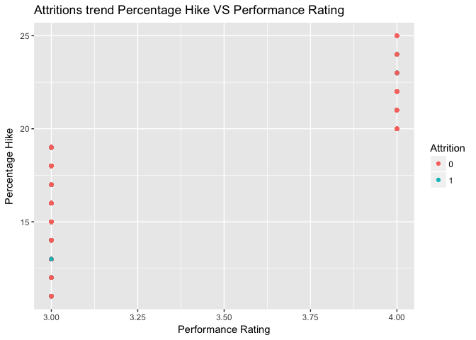

Exploratory Analysis
====================

    employee <- read_csv("IBM-HR-Employee-Attrition.csv")

    ## Parsed with column specification:
    ## cols(
    ##   .default = col_integer(),
    ##   Attrition = col_character(),
    ##   BusinessTravel = col_character(),
    ##   Department = col_character(),
    ##   EducationField = col_character(),
    ##   Gender = col_character(),
    ##   JobRole = col_character(),
    ##   MaritalStatus = col_character(),
    ##   Over18 = col_character(),
    ##   OverTime = col_character()
    ## )

    ## See spec(...) for full column specifications.

    quit <- filter(employee, Attrition=="Yes")
    stayed <- filter(employee, Attrition=="No")

Graph of average monthly income across all roles faceted by gender

    gender_influence <- employee %>% group_by(Gender, JobRole) %>% summarise(average_monthly_income=mean(MonthlyIncome))
    gender_influence_monthlyincome <- gender_influence %>% mutate(round_income=round(average_monthly_income))
    ggplot(gender_influence_monthlyincome, aes(x=Gender,y=average_monthly_income, color=Gender))+
      geom_bar(stat = "identity",width=0.5,position=position_dodge())+
      geom_text(aes(label=round_income), vjust=1.6, color="white",
                position = position_dodge(0.9), size=3.5)+
      facet_wrap(~JobRole)+
      theme_minimal()+
      scale_fill_manual(values=c("red", "blue"))+
      ggtitle("Monthly incomes across Job Roles")+
      scale_y_continuous(name="Average Monthly Income")

Graph of percent of employee lost across job roles

    Job_roles <- unique(quit$JobRole)
    roles_quit <- str_count(Job_roles)
    loss_by_job <- data_frame(Job=Job_roles, "Percentage loss"=(roles_quit/1470)*100)
    loss_by_job <- loss_by_job %>% mutate(round_loss=round(loss_by_job$`Percentage loss`,digits=2))
    loss_by_job <- arrange(loss_by_job, desc(round_loss))
    ggplot(loss_by_job, aes(x=reorder(loss_by_job$Job,-loss_by_job$round_loss),y=loss_by_job$round_loss))+
      geom_bar(stat = "identity",width=0.5, position=position_dodge())+
      geom_text(aes(label=loss_by_job$round_loss), vjust=1.6, color="white",
                position = position_dodge(0.9), size=3.5)+
      theme(axis.text.x=element_text(angle=90,hjust=1,vjust=0.5))+
      labs(x="Job Roles",y="Percentage of Loss")+
      ggtitle("Loss percentage across different Job Roles")

Average monthly income based on Marital status

    testing <- employee %>% group_by(MaritalStatus) %>% summarise(mean=round(mean(MonthlyIncome),digits=0))
    ggplot(testing, aes(x=testing$MaritalStatus,y=testing$mean))+
      geom_bar(stat = "identity",width=0.5, position=position_dodge())+
      geom_text(aes(label=testing$mean), vjust=1.6, color="white",
                position = position_dodge(0.9), size=3.5)+
      labs(x="Marital Status",y="Average Monthly Income")+
      ggtitle("Put a ring on it")

Average monthly income across different levels of Relationship
satisfaction

    RelSat <-employee %>% group_by(RelationshipSatisfaction) %>% summarise(mean=mean(MonthlyIncome))
    ggplot(RelSat, aes(x=reorder(RelSat$RelationshipSatisfaction,-RelSat$mean),y=RelSat$mean))+
      geom_bar(stat = "identity",width=0.5, position=position_dodge())+
      geom_text(aes(label=round(RelSat$mean)), vjust=1.6, color="white",
                position = position_dodge(0.9), size=3.5)+
      labs(x="Relationship Satisfaction",y="Average Monthly Income")+
      ggtitle("99 Problems")

Average monthly income across different levels of Job Satisfaction

    JobSat <- employee %>% group_by( JobSatisfaction) %>% summarise(mean=mean(MonthlyIncome))
    Jobsatty <- c("Low", "Medium", "High", "Very High")
    ggplot(JobSat, aes(x=reorder(Jobsatty,-JobSat$mean),y=JobSat$mean))+
      geom_bar(stat = "identity",width=0.5, position=position_dodge())+
      geom_text(aes(label=round(JobSat$mean)), vjust=1.6, color="white",
                position = position_dodge(0.9), size=3.5)+
      labs(x="Job Satisfaction",y="Average Monthly Income")+
      ggtitle("Mo Money Mo Problems")

There is no significant linear relationship between Work life balance
and years since last promotion

    lin_reg <- lm(WorkLifeBalance~ YearsSinceLastPromotion, employee)
    summary(lin_reg)

    ## 
    ## Call:
    ## lm(formula = WorkLifeBalance ~ YearsSinceLastPromotion, data = employee)
    ## 
    ## Residuals:
    ##     Min      1Q  Median      3Q     Max 
    ## -1.7844 -0.7569  0.2391  0.2431  1.2431 
    ## 
    ## Coefficients:
    ##                         Estimate Std. Error t value Pr(>|t|)    
    ## (Intercept)             2.756936   0.022281 123.736   <2e-16 ***
    ## YearsSinceLastPromotion 0.001960   0.005722   0.343    0.732    
    ## ---
    ## Signif. codes:  0 '***' 0.001 '**' 0.01 '*' 0.05 '.' 0.1 ' ' 1
    ## 
    ## Residual standard error: 0.7067 on 1468 degrees of freedom
    ## Multiple R-squared:  7.995e-05,  Adjusted R-squared:  -0.0006012 
    ## F-statistic: 0.1174 on 1 and 1468 DF,  p-value: 0.732

There is no relationship between performance rating and monthly income

    boxplot(MonthlyIncome~WorkLifeBalance,data = employee,xlab="PerformanceRating", ylab="MonthlyIncome")

The figure below is also the visualization of correlations between 5
features. The distribution of each variable is shown on the diagonal. On
the bottom of the diagonal : the bivariate scatter plots with a fitted
line are isplayed On the top of the diagonal : the value of the
correlation plus the significance level as stars. Each significance
level is associated to a symbol : p-values(0, 0.001, 0.01, 0.05, 0.1, 1)
&lt;=&gt; symbols(“***”, “**”, “*”, “.”, " “)

    numeric <- employee[, c(1,4,6,7,10)]
    #see correlation between features 
    res2 <- rcorr(as.matrix(numeric)) # data must be a matrix 

    flattenCorrMatrix <- function(cormat, pmat) {
      ut <- upper.tri(cormat)
      data.frame(
        row = rownames(cormat)[row(cormat)[ut]],
        column = rownames(cormat)[col(cormat)[ut]],
        cor  =(cormat)[ut],
        p = pmat[ut]
      )
    }

    flattenCorrMatrix(res2$r, res2$P)

    ##                 row           column          cor            p
    ## 1               Age        DailyRate  0.010660943 6.829722e-01
    ## 2               Age DistanceFromHome -0.001686120 9.484990e-01
    ## 3         DailyRate DistanceFromHome -0.004985337 8.485418e-01
    ## 4               Age        Education  0.208033726 8.881784e-16
    ## 5         DailyRate        Education -0.016806433 5.196625e-01
    ## 6  DistanceFromHome        Education  0.021041825 4.201513e-01
    ## 7               Age   EmployeeNumber -0.010145467 6.975261e-01
    ## 8         DailyRate   EmployeeNumber -0.050990433 5.062898e-02
    ## 9  DistanceFromHome   EmployeeNumber  0.032916408 2.071999e-01
    ## 10        Education   EmployeeNumber  0.042070094 1.068894e-01

    suppressWarnings(chart.Correlation(numeric, histogram=TRUE, pch=19))

The figure below shows female has higher avarage salary than males in
IBM

    genderIncome <- employee %>% group_by(Gender) %>%
      summarise(meanSalary = mean(MonthlyIncome))
    ggplot(genderIncome, aes (x = Gender, y = meanSalary)) + geom_bar(stat ="identity") + ggtitle("Mean monthly income between gender ")

The below plot shows gender distribution of gender across jobs

    ggplot(employee, aes(x = Gender, color = Gender)) +
      geom_bar()+ facet_wrap(~ JobRole)+ggtitle("Job distribution among gender")+ ggtitle("Job distribution across gender ")

The figure below illastrates the job distribution between male and
female

    genderJobIncome <- employee  %>% group_by(Gender, JobRole) %>%
      summarise(meanSalarybyJob = mean(MonthlyIncome))
    ggplot(genderJobIncome, aes(x = JobRole,y = meanSalarybyJob, color = Gender)) +
      geom_point() +ggtitle("Mean monthly income among diffrent jobs across gender ")

    employee$Attrition[employee$Attrition=="Yes"] <- 1
    employee$Attrition[employee$Attrition=="No"] <- 0
    integer_data <-employee[,c(1,2,4,6,7,10,11,13,14,15,17,19,20,21,24,25,26,28:35)]
    integer_data$Attrition <-as.numeric(integer_data$Attrition)
    correlation_data <- cor(integer_data)
    corrplot(correlation_data,method="circle")

    quit <- filter(employee, Attrition==1)
    ggplot(data=quit)+
      geom_point(aes(y=quit$MonthlyIncome, x=quit$BusinessTravel,color=JobRole))+
      labs(y="Monthly Income", x="Travels")+
      ggtitle("Attritions trend Income VS Travel")

    ggplot(data=employee)+
      geom_point(aes(y=employee$MonthlyIncome, x=employee$TotalWorkingYears,color=JobRole))+
      labs(y="Monthly Income", x="Working Years")+
      ggtitle("Observing trend of Income VS Working Years")

    ggplot(data=employee)+
      geom_point(aes(y=employee$PercentSalaryHike, x=employee$PerformanceRating, color=Attrition))+
      labs(y="Percentage Hike", x="Performance Rating")+
      ggtitle("Attritions trend Percentage Hike VS Performance Rating")

