Abstract
--------

The purpose of this project is to analyze data provided from IBM’s Human
resource department in order to understand the common characteristics in
employee attrition, or possible employee discrimination. In order to
weight the importance of each variable presented, we filtered the data
based on variables that were integer type and performed a correlation
analysis. By doing so we were able to develop a basic understanding of
which variables to include in our predictive model. The predictive model
that we have developed has proven to predict employee attrition with an
84% accuracy rate. We also wanted to consider relationships in
non-integer type variables in hopes of observing possible discrimination
trends that can be supported by the dataset. We developed a number of
visuals in order to justify our conclusions. Lastly, we strived to
develop a user-friendly Shiny app for possible managers to use in order
to predict employee attrition. All code and details shall be presented
in the appropriate Rmd files as part of the final project.

Overview and Motivation:
------------------------

The issue of keeping one's employees happy and satisfied is a perennial
and age-old challenge. If an employee you have invested so much time and
money leaves for "greener pastures", then this would mean that you would
have to spend even more time and money to hire somebody else. Alongside
these reason maintaining happy employees have resulted in increase
profit for companies based on various studies done in industry. By
understanding the main reasons why employees leave and possible
discrimination, the increase probability your company will succeed.

Related Work
------------

In class we had discussed effective techniques of communication. As a
team we took that to heart and wanted to develop models that were not
only easy to understand but visually pleasing. We have looked into
various psychology journals, which study employee habits and utility in
order to develop a healthy reasoning of what possible variables are
important based on published studies.

Initial Questions
-----------------

-   Does Marital Status have a significant effect on wages?
-   How does performance rating contribute to monthly income?
-   How do different departments contribute to employee attrition?
-   How do different job roles contribute to employee attrition?
-   Can we give a general idea of working atmosphere based on department
    or job role attrition?
-   Can we predict employee attrition?
-   Does a higher education level contribute to lower attrition levels?
-   How can we tell if an employee is happy?
-   Does work life balance concur with years in position or years with
    company? How about with monthly income?

Some of these questions were answered by using visuals such as scatter
plots, bar graphs, and others. While with other questions such as
predicting employee attrition, we developed a healthy predictive model
based on the random forest classifier, which enabled an 84% accuracy
rate. Though some of the questions were straightforward and were
answered with yes or no, a few of them were impossible to determine. One
impossible question to answer was “How can we tell if an employee is
happy.” Essentially this question boils down to looking into background
studies, which observe employee utility from psychology journals. Yet
with what these studies propose we did not have the data for thus
forcing us to abandon a few questions. One of the main issues with the
data set was not the organization but the type of the variables and
transforming different types to allow for smooth analysis. For example;
on two of our team members laptop the “Age” variable operated as a
normal numeric yet with the last team mate the “Age” variable only
produced errors. Running into small technical issues which were resolved
using Google while also performing other yak shaving activities did slow
us down but in the end allowed for worthwhile analysis.

    employee <- read_csv("IBM-HR-Employee-Attrition.csv")

    ## Parsed with column specification:
    ## cols(
    ##   .default = col_integer(),
    ##   Attrition = col_character(),
    ##   BusinessTravel = col_character(),
    ##   Department = col_character(),
    ##   EducationField = col_character(),
    ##   Gender = col_character(),
    ##   JobRole = col_character(),
    ##   MaritalStatus = col_character(),
    ##   Over18 = col_character(),
    ##   OverTime = col_character()
    ## )

    ## See spec(...) for full column specifications.

    quit <- filter(employee, Attrition=="Yes") #Filter employee data based on those who have quit
    stayed <- filter(employee, Attrition=="No") #Filter employee data based on those who have stayed

    # plot1
    gender_influence <- employee %>% group_by(Gender, JobRole) %>%  summarise(average_monthly_income=mean(MonthlyIncome))
    gender_influence_monthlyincome <- gender_influence %>% mutate(round_income=round(average_monthly_income))
    ggplot(gender_influence_monthlyincome, aes(x=Gender,y=average_monthly_income, color=Gender))+
      geom_bar(stat = "identity",width=0.5,position=position_dodge())+
      geom_text(aes(label=round_income), vjust=1.6, color="white",
                position = position_dodge(0.9), size=3.5)+
      facet_wrap(~JobRole)+
      theme_minimal()+
      scale_fill_manual(values=c("red", "blue"))+
      ggtitle("Monthly incomes across Job Roles")+
      scale_y_continuous(name="Average Monthly Income")

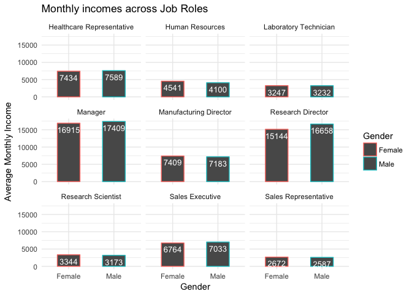

    #Grouped employee data by "Gender" and "JobRole" in order to summarise average monthly income based on hose to factors. To make the plot look visually pleasing we rounded the Monthly income and placed it inside of the bar graph, we also highlighted which Gender is represented using blue for male and red for female. We removed the theme to increase signal to noise ratio. Finally we made sure to label the graph, x and y axis for clear interpretation.

Represents the average monthly incomes based on gender which we then
faceted against Job roles to observe the possible pay gap between
genders across various Job roles. From first looking at the graph you
may see slight gaps between the genders in certain roles such as
Research Director and Manager which one might conclude as insignificant.
But if we take the sum for the year of monthly income for Research
Director then males will be making a total of $199,896 versus females
making a total of $181,728. A $18,168 pay gap!

    # plot2
    Job_roles <- unique(quit$JobRole)
    roles_quit <- str_count(Job_roles)
    loss_by_job <- data_frame(Job=Job_roles, "Percentage loss"=(roles_quit/1470)*100)
    loss_by_job <- loss_by_job %>% mutate(round_loss=round(loss_by_job$`Percentage loss`,digits=2))
    loss_by_job <- arrange(loss_by_job, desc(round_loss))
    exploratory_plot2 <- ggplot(loss_by_job, aes(x=reorder(loss_by_job$Job,-loss_by_job$round_loss),y=loss_by_job$round_loss))+
      geom_bar(stat = "identity",width=0.5, position=position_dodge())+
      geom_text(aes(label=loss_by_job$round_loss), vjust=1.6, color="white",
                position = position_dodge(0.9), size=3.5)+
      theme(axis.text.x=element_text(angle=90,hjust=1,vjust=0.5))+
      labs(x="Job Roles",y="Percentage of Loss")+
      ggtitle("Loss percentage across different Job Roles")
    exploratory_plot2

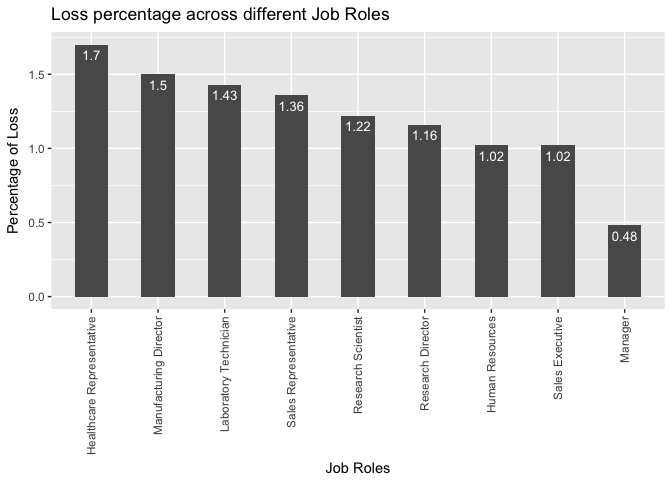

    #Found all job roles that had quit and counted each position. Then divided the total count of each position by total observation. Arranged the loss by decreasing amount and graphed using bar plot using similar labels as exploratory plot 1.

We wanted to know based on Job roles where was the attrition coming
from? With the bar graph we found that the top three job roles with the
highest attrition by percentage were Healthcare Representative,
Manufacturing Director, and Laboratory Technician. So why does this
graph matter? We suggest that IBM looks into the underlying reasons why
these roles have the highest loss. From the definition we understand
that any loss will result in cost for the company. Are employees unhappy
in these roles, are they treated fairly, and are there opportunities for
growth?

    # plot3
    testing <- employee %>% group_by(MaritalStatus) %>% summarise(mean=round(mean(MonthlyIncome),digits=0))
    exploratory_plot3 <- ggplot(testing, aes(x=testing$MaritalStatus,y=testing$mean))+
      geom_bar(stat = "identity",width=0.5, position=position_dodge())+
      geom_text(aes(label=testing$mean), vjust=1.6, color="white",
                position = position_dodge(0.9), size=3.5)+
      labs(x="Marital Status",y="Average Monthly Income")+
      ggtitle("Put a ring on it")
    exploratory_plot3

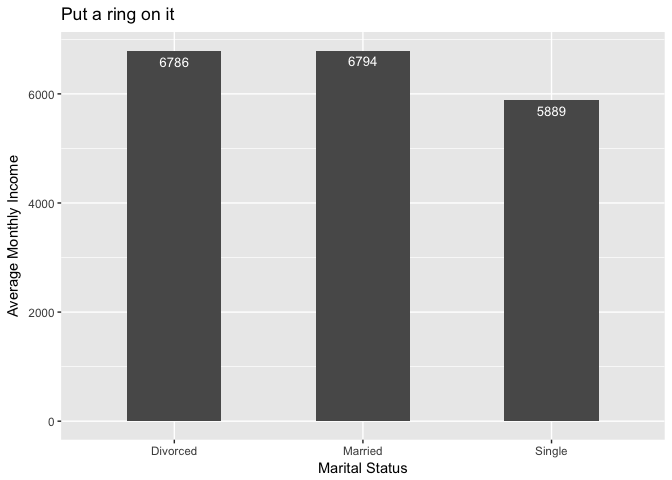

    #Group the original data set by Marital status and summarize mean monthly income. Then graphed the monthly income averages according to each category of marital status.

After grouping by relationship status, we averaged the monthly income in
order to observe any possible trends that occur based on marital status.
We concluded that employees who were single observed a deficit of $897
in average monthly income relative to the divorced and married
categories.

    # plot4
    RelSat <-employee %>% group_by(RelationshipSatisfaction) %>% summarise(mean=mean(MonthlyIncome))
    exploratory_plot4 <- ggplot(RelSat, aes(x=reorder(RelSat$RelationshipSatisfaction,-RelSat$mean),y=RelSat$mean))+
      geom_bar(stat = "identity",width=0.5, position=position_dodge())+
      geom_text(aes(label=round(RelSat$mean)), vjust=1.6, color="white",
                position = position_dodge(0.9), size=3.5)+
      labs(x="Relationship Satisfaction",y="Average Monthly Income")+
      ggtitle("99 Problems")
    exploratory_plot4

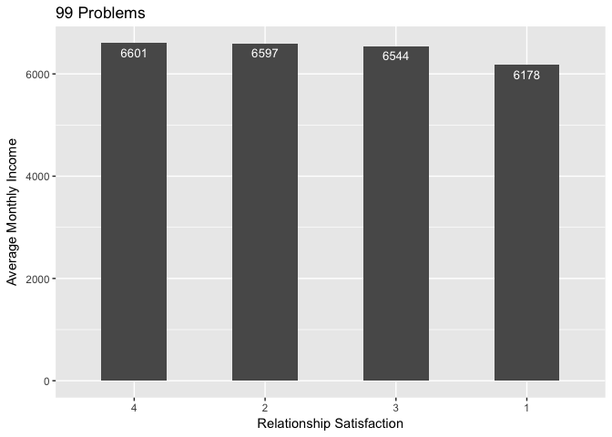

    #Grouped the original data set based on Relationship Satisfaction and summarized average monthly income. Present the average monthly incomes based on Relationship Satisfaction using a bar graph and used appropriate labels.

Similar to the first plot we grouped our x-axis by “Relationship
Satisfaction” and observed average monthly income of the 4 groups. We
observed that as the level of satisfaction an employee perceives in
their relationship the higher average monthly income they earn. Some
psychology studies have concluded that a happy and successful
relationship outside of work results in being more productive and thus
earning more at work. Although we have the background theory, we do not
have further data to support these claims, but to simply make
observations and state our hypothesis.

    # plot5
    JobSat <- employee %>% group_by( JobSatisfaction) %>% summarise(mean=mean(MonthlyIncome))
    Jobsatty <- c("Low", "Medium", "High", "Very High")
    exploratory_plot5 <- ggplot(JobSat, aes(x=reorder(Jobsatty,-JobSat$mean),y=JobSat$mean))+
      geom_bar(stat = "identity",width=0.5, position=position_dodge())+
      geom_text(aes(label=round(JobSat$mean)), vjust=1.6, color="white",
                position = position_dodge(0.9), size=3.5)+
      labs(x="Job Satisfaction",y="Average Monthly Income")+
      ggtitle("Mo Money Mo Problems")
    exploratory_plot5

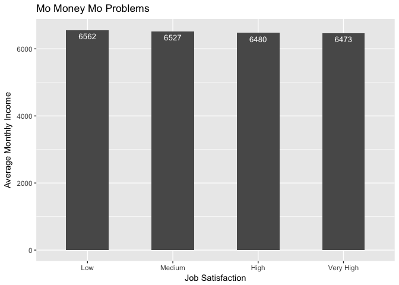

    #Grouped the original data set based on Job Satisfaction and summarized average monthly income. Present the average monthly incomes based on Job Satisfaction using a bar graph and used appropriate labels.

We observed the average monthly income based on Job satisfaction and
found an interesting trend. As the level of satisfaction for one’s job
decreases, the average monthly income that one earns increases. Our
reasoning begins with the idea that with increased pay comes increased
amounts of responsibility, which in turn causes more stress to perform
well and ensure that one’s team is performing well.

    # plot6
    lin_reg <- lm(WorkLifeBalance~ YearsSinceLastPromotion, employee)
    exploratory_plot6 <- summary(lin_reg)
    exploratory_plot6

    ## 
    ## Call:
    ## lm(formula = WorkLifeBalance ~ YearsSinceLastPromotion, data = employee)
    ## 
    ## Residuals:
    ##     Min      1Q  Median      3Q     Max 
    ## -1.7844 -0.7569  0.2391  0.2431  1.2431 
    ## 
    ## Coefficients:
    ##                         Estimate Std. Error t value Pr(>|t|)    
    ## (Intercept)             2.756936   0.022281 123.736   <2e-16 ***
    ## YearsSinceLastPromotion 0.001960   0.005722   0.343    0.732    
    ## ---
    ## Signif. codes:  0 '***' 0.001 '**' 0.01 '*' 0.05 '.' 0.1 ' ' 1
    ## 
    ## Residual standard error: 0.7067 on 1468 degrees of freedom
    ## Multiple R-squared:  7.995e-05,  Adjusted R-squared:  -0.0006012 
    ## F-statistic: 0.1174 on 1 and 1468 DF,  p-value: 0.732

    #explored linear regression of work life balance against years since last promotion and summarized.

This is a summary of a linear regression of Work life balance against
Years since last promotion in an attempt to distinguish the overall
atmosphere and attitude an employee who stays longer with the company
develops. The results were inconclusive.

    # plot7
    exploratory_plot7 <- boxplot(MonthlyIncome~WorkLifeBalance,data = employee,xlab="Work Life Balance", ylab="Monthly Income")

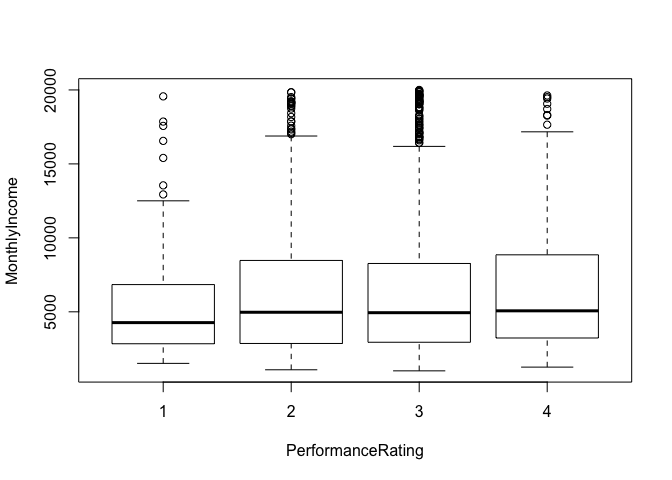

    exploratory_plot7

    ## $stats
    ##         [,1]  [,2]  [,3]  [,4]
    ## [1,]  1514.0  1081  1009  1261
    ## [2,]  2840.5  2860  2942  3230
    ## [3,]  4269.5  4970  4941  5067
    ## [4,]  6840.5  8473  8268  8853
    ## [5,] 12504.0 16885 16184 17169
    ## attr(,"class")
    ##         1 
    ## "integer" 
    ## 
    ## $n
    ## [1]  80 344 893 153
    ## 
    ## $conf
    ##          [,1]    [,2]   [,3]     [,4]
    ## [1,] 3562.903 4491.84 4659.4 4348.744
    ## [2,] 4976.097 5448.16 5222.6 5785.256
    ## 
    ## $out
    ##   [1] 13549 16555 19566 17861 15402 17567 12936 19094 18947 18740 18172
    ##  [12] 17181 19517 19144 17584 19406 19141 18430 17099 17399 19237 19847
    ##  [23] 19190 17861 17328 17007 19049 19833 17875 19431 18880 19545 18844
    ##  [34] 17328 19537 19926 19033 18722 19999 16792 19232 19202 19436 19045
    ##  [45] 18665 17068 19272 18300 16659 19197 18041 17046 16835 16595 19502
    ##  [56] 18200 19189 19859 17639 19246 17159 17924 17444 19973 19845 19627
    ##  [67] 17665 17465 19943 18606 17048 17856 19081 17779 19740 18213 18824
    ##  [78] 18789 18061 17123 16880 19187 19717 16799 19701 16437 19586 19331
    ##  [89] 19613 19658 16413 17426 17603 16704 19038 19328 19392 19665 16823
    ## [100] 17174 19161 19636 19068 19513 19419 18303 17650 19626 18711 18265
    ## 
    ## $group
    ##   [1] 1 1 1 1 1 1 1 2 2 2 2 2 2 2 2 2 2 2 2 2 2 2 2 2 2 2 2 2 2 2 2 3 3 3 3
    ##  [36] 3 3 3 3 3 3 3 3 3 3 3 3 3 3 3 3 3 3 3 3 3 3 3 3 3 3 3 3 3 3 3 3 3 3 3
    ##  [71] 3 3 3 3 3 3 3 3 3 3 3 3 3 3 3 3 3 3 3 3 3 3 3 3 3 3 3 3 3 3 3 3 4 4 4
    ## [106] 4 4 4 4 4
    ## 
    ## $names
    ## [1] "1" "2" "3" "4"

    #Created a boxplot using monthly income as the y-axis and Work life balance as x-asxis. Then used appropriate labels 

We wondered whether Performance rating would have an effect on Monthly
income thus we used a box plot to compare the difference performance
ratings beside each other. The conclusion was that there was not enough
significance between the rating groups to emphasize any trend.

    # plot8
    numeric <- employee[, c(1,4,6,7,10)]
    #see correlation between certain features 
    res2 <- rcorr(as.matrix(numeric)) # data must be a matrix 

    flattenCorrMatrix <- function(cormat, pmat) {
      ut <- upper.tri(cormat)
      data.frame(
        row = rownames(cormat)[row(cormat)[ut]],
        column = rownames(cormat)[col(cormat)[ut]],
        cor  =(cormat)[ut],
        p = pmat[ut]
      )
    }

    exploratory_plot8 <- flattenCorrMatrix(res2$r, res2$P)
    exploratory_plot8

    ##                 row           column          cor            p
    ## 1               Age        DailyRate  0.010660943 6.829722e-01
    ## 2               Age DistanceFromHome -0.001686120 9.484990e-01
    ## 3         DailyRate DistanceFromHome -0.004985337 8.485418e-01
    ## 4               Age        Education  0.208033726 8.881784e-16
    ## 5         DailyRate        Education -0.016806433 5.196625e-01
    ## 6  DistanceFromHome        Education  0.021041825 4.201513e-01
    ## 7               Age   EmployeeNumber -0.010145467 6.975261e-01
    ## 8         DailyRate   EmployeeNumber -0.050990433 5.062898e-02
    ## 9  DistanceFromHome   EmployeeNumber  0.032916408 2.071999e-01
    ## 10        Education   EmployeeNumber  0.042070094 1.068894e-01

    # plot9
    exploratory_plot9 <- chart.Correlation(numeric, histogram=TRUE, pch=19)

    ## Warning in plot.window(...): "method" is not a graphical parameter

    ## Warning in plot.xy(xy, type, ...): "method" is not a graphical parameter

    ## Warning in title(...): "method" is not a graphical parameter

    ## Warning in plot.window(...): "method" is not a graphical parameter

    ## Warning in plot.xy(xy, type, ...): "method" is not a graphical parameter

    ## Warning in title(...): "method" is not a graphical parameter

    ## Warning in axis(side = side, at = at, labels = labels, ...): "method" is
    ## not a graphical parameter

    ## Warning in plot.window(...): "method" is not a graphical parameter

    ## Warning in plot.xy(xy, type, ...): "method" is not a graphical parameter

    ## Warning in title(...): "method" is not a graphical parameter

    ## Warning in plot.window(...): "method" is not a graphical parameter

    ## Warning in plot.xy(xy, type, ...): "method" is not a graphical parameter

    ## Warning in title(...): "method" is not a graphical parameter

    ## Warning in axis(side = side, at = at, labels = labels, ...): "method" is
    ## not a graphical parameter

    ## Warning in plot.window(...): "method" is not a graphical parameter

    ## Warning in plot.xy(xy, type, ...): "method" is not a graphical parameter

    ## Warning in title(...): "method" is not a graphical parameter

    ## Warning in axis(side = side, at = at, labels = labels, ...): "method" is
    ## not a graphical parameter

    ## Warning in plot.window(...): "method" is not a graphical parameter

    ## Warning in plot.xy(xy, type, ...): "method" is not a graphical parameter

    ## Warning in title(...): "method" is not a graphical parameter

    ## Warning in axis(side = side, at = at, labels = labels, ...): "method" is
    ## not a graphical parameter

    ## Warning in plot.xy(xy.coords(x, y), type = type, ...): "method" is not a
    ## graphical parameter

    ## Warning in plot.window(...): "method" is not a graphical parameter

    ## Warning in plot.xy(xy, type, ...): "method" is not a graphical parameter

    ## Warning in title(...): "method" is not a graphical parameter

    ## Warning in plot.window(...): "method" is not a graphical parameter

    ## Warning in plot.xy(xy, type, ...): "method" is not a graphical parameter

    ## Warning in title(...): "method" is not a graphical parameter

    ## Warning in plot.window(...): "method" is not a graphical parameter

    ## Warning in plot.xy(xy, type, ...): "method" is not a graphical parameter

    ## Warning in title(...): "method" is not a graphical parameter

    ## Warning in plot.window(...): "method" is not a graphical parameter

    ## Warning in plot.xy(xy, type, ...): "method" is not a graphical parameter

    ## Warning in title(...): "method" is not a graphical parameter

    ## Warning in plot.window(...): "method" is not a graphical parameter

    ## Warning in plot.xy(xy, type, ...): "method" is not a graphical parameter

    ## Warning in title(...): "method" is not a graphical parameter

    ## Warning in plot.xy(xy.coords(x, y), type = type, ...): "method" is not a
    ## graphical parameter

    ## Warning in plot.window(...): "method" is not a graphical parameter

    ## Warning in plot.xy(xy, type, ...): "method" is not a graphical parameter

    ## Warning in title(...): "method" is not a graphical parameter

    ## Warning in plot.xy(xy.coords(x, y), type = type, ...): "method" is not a
    ## graphical parameter

    ## Warning in plot.window(...): "method" is not a graphical parameter

    ## Warning in plot.xy(xy, type, ...): "method" is not a graphical parameter

    ## Warning in title(...): "method" is not a graphical parameter

    ## Warning in plot.window(...): "method" is not a graphical parameter

    ## Warning in plot.xy(xy, type, ...): "method" is not a graphical parameter

    ## Warning in title(...): "method" is not a graphical parameter

    ## Warning in plot.window(...): "method" is not a graphical parameter

    ## Warning in plot.xy(xy, type, ...): "method" is not a graphical parameter

    ## Warning in title(...): "method" is not a graphical parameter

    ## Warning in axis(side = side, at = at, labels = labels, ...): "method" is
    ## not a graphical parameter

    ## Warning in plot.window(...): "method" is not a graphical parameter

    ## Warning in plot.xy(xy, type, ...): "method" is not a graphical parameter

    ## Warning in title(...): "method" is not a graphical parameter

    ## Warning in axis(side = side, at = at, labels = labels, ...): "method" is
    ## not a graphical parameter

    ## Warning in plot.xy(xy.coords(x, y), type = type, ...): "method" is not a
    ## graphical parameter

    ## Warning in plot.window(...): "method" is not a graphical parameter

    ## Warning in plot.xy(xy, type, ...): "method" is not a graphical parameter

    ## Warning in title(...): "method" is not a graphical parameter

    ## Warning in plot.xy(xy.coords(x, y), type = type, ...): "method" is not a
    ## graphical parameter

    ## Warning in plot.window(...): "method" is not a graphical parameter

    ## Warning in plot.xy(xy, type, ...): "method" is not a graphical parameter

    ## Warning in title(...): "method" is not a graphical parameter

    ## Warning in plot.xy(xy.coords(x, y), type = type, ...): "method" is not a
    ## graphical parameter

    ## Warning in plot.window(...): "method" is not a graphical parameter

    ## Warning in plot.xy(xy, type, ...): "method" is not a graphical parameter

    ## Warning in title(...): "method" is not a graphical parameter

    ## Warning in plot.window(...): "method" is not a graphical parameter

    ## Warning in plot.xy(xy, type, ...): "method" is not a graphical parameter

    ## Warning in title(...): "method" is not a graphical parameter

    ## Warning in plot.window(...): "method" is not a graphical parameter

    ## Warning in plot.xy(xy, type, ...): "method" is not a graphical parameter

    ## Warning in title(...): "method" is not a graphical parameter

    ## Warning in axis(side = side, at = at, labels = labels, ...): "method" is
    ## not a graphical parameter

    ## Warning in plot.xy(xy.coords(x, y), type = type, ...): "method" is not a
    ## graphical parameter

    ## Warning in plot.window(...): "method" is not a graphical parameter

    ## Warning in plot.xy(xy, type, ...): "method" is not a graphical parameter

    ## Warning in title(...): "method" is not a graphical parameter

    ## Warning in plot.xy(xy.coords(x, y), type = type, ...): "method" is not a
    ## graphical parameter

    ## Warning in plot.window(...): "method" is not a graphical parameter

    ## Warning in plot.xy(xy, type, ...): "method" is not a graphical parameter

    ## Warning in title(...): "method" is not a graphical parameter

    ## Warning in axis(side = side, at = at, labels = labels, ...): "method" is
    ## not a graphical parameter

    ## Warning in plot.xy(xy.coords(x, y), type = type, ...): "method" is not a
    ## graphical parameter

    ## Warning in plot.window(...): "method" is not a graphical parameter

    ## Warning in plot.xy(xy, type, ...): "method" is not a graphical parameter

    ## Warning in title(...): "method" is not a graphical parameter

    ## Warning in plot.xy(xy.coords(x, y), type = type, ...): "method" is not a
    ## graphical parameter

    ## Warning in plot.window(...): "method" is not a graphical parameter

    ## Warning in plot.xy(xy, type, ...): "method" is not a graphical parameter

    ## Warning in title(...): "method" is not a graphical parameter

    ## Warning in axis(side = side, at = at, labels = labels, ...): "method" is
    ## not a graphical parameter

    ## Warning in axis(side = side, at = at, labels = labels, ...): "method" is
    ## not a graphical parameter

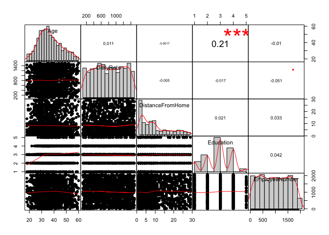

    exploratory_plot9

    ## NULL

Performing a correlation against Age, daily rate, distance from home,
education, and employee number we did not find any significant
correlation. Thus later on we decided to perform a correlation on all
numeric variables against each other.

    # plot10
    genderIncome <- employee %>% group_by(Gender) %>%
      summarise(meanSalary = mean(MonthlyIncome))
    exploratory_plot10 <- ggplot(genderIncome, aes (x = Gender, y = meanSalary)) +  ggtitle("Mean monthly income between gender ")+ geom_bar(stat = "identity",width=0.5, position=position_dodge())+
      geom_text(aes(label=round(meanSalary)), vjust=1.6, color="white",
                position = position_dodge(0.9), size=3.5)
    exploratory_plot10

    #Grouped the original data set by gender and summarized average monthly salary. This bar graph represents the average monthly salary general between genders. Used similar labels as exploratory plot 1.

As a general plot we wanted to understand, regardless of job roles,
education, or other factors how does the average monthly income differ
between males and females. The surprising conclusion from the graph was
that females overall made $306 more money than males. It would be then
be helpful to look at our first exploratory plot to understand where
this trend may be coming from.

    # plot11
    exploratory_plot11 <- ggplot(employee, aes(x = Gender, color = Gender)) +
      geom_bar()+ facet_wrap(~ JobRole)+ggtitle("Job distribution among gender")+ ggtitle("Job distribution across gender ")
    exploratory_plot11

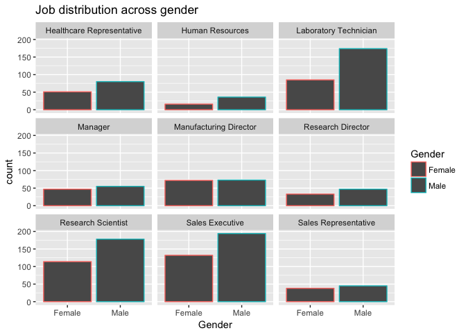

    #Decided to develop a visual of the amount of employees based on gender across all departments. Using geom_bar we were able to find interesting distributions.

Understanding how many females and males account for job roles is also
an important question to ask. We may move away from monthly salary and
ask based on the amount of each gender is there a tendency to hire or
attract a certain gender into certain positions. Questions to ask for
instance would be; in the Laboratory technician positions is the gap
there due to a shortage of qualified female laboratory technicians or
are the hiring managers discriminating against females. Now statistics
with inadequate data will not give you the immediate answer but it will
provide a compass of where to look.

    # plot12
    genderJobIncome <- employee  %>% group_by(Gender, JobRole) %>%
      summarise(meanSalarybyJob = mean(MonthlyIncome))
    exploratory_plot12 <- ggplot(genderJobIncome, aes(x = JobRole,y = meanSalarybyJob, color = Gender)) +
      geom_point() +ggtitle("Mean monthly income among diffrent jobs across gender ")
    exploratory_plot12

    #By group gender and Job role we then summarized average monthly income and represented it in a scatter plot. Using appropriate labels as exploratory plot 1.

By grouping according to gender and Job role we then summarized the mean
monthly income in order to create a scatterplot that in theory would
emphasize the difference between genders across all job roles. Though a
scatterplot in this situation we found not to be the most influential of
graphs.

    # plot13
    employee$Attrition[employee$Attrition=="Yes"] <- 1
    employee$Attrition[employee$Attrition=="No"] <- 0
    integer_data <-employee[,c(1,2,4,6,7,10,11,13,14,15,17,19,20,21,24,25,26,28:35)]
    integer_data$Attrition <-as.numeric(integer_data$Attrition)
    correlation_data <- cor(integer_data)
    exploratory_plot13 <-corrplot(correlation_data,method="circle")

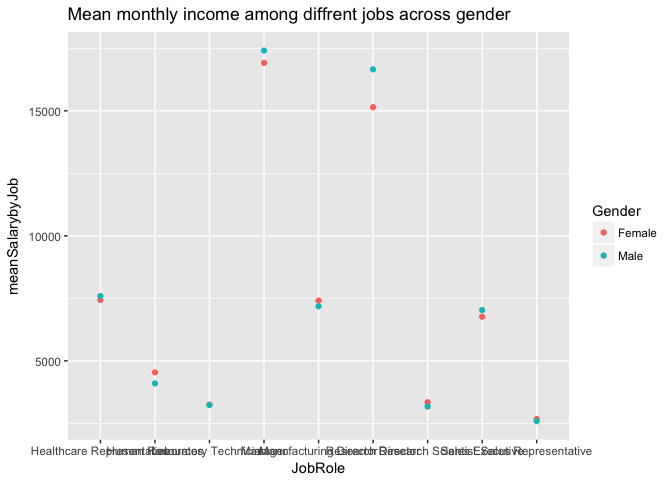

    exploratory_plot13

    ##                                   Age    Attrition     DailyRate
    ## Age                       1.000000000 -0.159205007  0.0106609426
    ## Attrition                -0.159205007  1.000000000 -0.0566519919
    ## DailyRate                 0.010660943 -0.056651992  1.0000000000
    ## DistanceFromHome         -0.001686120  0.077923583 -0.0049853374
    ## Education                 0.208033731 -0.031372820 -0.0168064332
    ## EmployeeNumber           -0.010145467 -0.010577243 -0.0509904337
    ## EnvironmentSatisfaction   0.010146428 -0.103368978  0.0183548543
    ## HourlyRate                0.024286543 -0.006845550  0.0233814215
    ## JobInvolvement            0.029819959 -0.130015957  0.0461348740
    ## JobLevel                  0.509604228 -0.169104751  0.0029663349
    ## JobSatisfaction          -0.004891877 -0.103481126  0.0305710078
    ## MonthlyIncome             0.497854567 -0.159839582  0.0077070589
    ## MonthlyRate               0.028051167  0.015170213 -0.0321816015
    ## NumCompaniesWorked        0.299634758  0.043493739  0.0381534343
    ## PercentSalaryHike         0.003633585 -0.013478202  0.0227036775
    ## PerformanceRating         0.001903896  0.002888752  0.0004732963
    ## RelationshipSatisfaction  0.053534720 -0.045872279  0.0078460310
    ## StockOptionLevel          0.037509712 -0.137144919  0.0421427964
    ## TotalWorkingYears         0.680380536 -0.171063246  0.0145147387
    ## TrainingTimesLastYear    -0.019620819 -0.059477799  0.0024525427
    ## WorkLifeBalance          -0.021490028 -0.063939047 -0.0378480510
    ## YearsAtCompany            0.311308770 -0.134392214 -0.0340547676
    ## YearsInCurrentRole        0.212901056 -0.160545004  0.0099320150
    ## YearsSinceLastPromotion   0.216513368 -0.033018775 -0.0332289848
    ## YearsWithCurrManager      0.202088602 -0.156199316 -0.0263631782
    ##                          DistanceFromHome    Education EmployeeNumber
    ## Age                          -0.001686120  0.208033731   -0.010145467
    ## Attrition                     0.077923583 -0.031372820   -0.010577243
    ## DailyRate                    -0.004985337 -0.016806433   -0.050990434
    ## DistanceFromHome              1.000000000  0.021041826    0.032916407
    ## Education                     0.021041826  1.000000000    0.042070093
    ## EmployeeNumber                0.032916407  0.042070093    1.000000000
    ## EnvironmentSatisfaction      -0.016075327 -0.027128313    0.017620802
    ## HourlyRate                    0.031130586  0.016774829    0.035179212
    ## JobInvolvement                0.008783280  0.042437634   -0.006887923
    ## JobLevel                      0.005302731  0.101588886   -0.018519194
    ## JobSatisfaction              -0.003668839 -0.011296117   -0.046246735
    ## MonthlyIncome                -0.017014445  0.094960677   -0.014828516
    ## MonthlyRate                   0.027472864 -0.026084197    0.012648229
    ## NumCompaniesWorked           -0.029250804  0.126316560   -0.001251032
    ## PercentSalaryHike             0.040235377 -0.011110941   -0.012943996
    ## PerformanceRating             0.027109618 -0.024538791   -0.020358825
    ## RelationshipSatisfaction      0.006557475 -0.009118377   -0.069861411
    ## StockOptionLevel              0.044871999  0.018422220    0.062226693
    ## TotalWorkingYears             0.004628426  0.148279697   -0.014365198
    ## TrainingTimesLastYear        -0.036942234 -0.025100241    0.023603170
    ## WorkLifeBalance              -0.026556004  0.009819189    0.010308641
    ## YearsAtCompany                0.009507720  0.069113696   -0.011240464
    ## YearsInCurrentRole            0.018844999  0.060235554   -0.008416312
    ## YearsSinceLastPromotion       0.010028836  0.054254334   -0.009019064
    ## YearsWithCurrManager          0.014406048  0.069065378   -0.009196645
    ##                          EnvironmentSatisfaction   HourlyRate
    ## Age                                  0.010146428  0.024286543
    ## Attrition                           -0.103368978 -0.006845550
    ## DailyRate                            0.018354854  0.023381422
    ## DistanceFromHome                    -0.016075327  0.031130586
    ## Education                           -0.027128313  0.016774829
    ## EmployeeNumber                       0.017620802  0.035179212
    ## EnvironmentSatisfaction              1.000000000 -0.049856956
    ## HourlyRate                          -0.049856956  1.000000000
    ## JobInvolvement                      -0.008277598  0.042860641
    ## JobLevel                             0.001211699 -0.027853486
    ## JobSatisfaction                     -0.006784353 -0.071334624
    ## MonthlyIncome                       -0.006259088 -0.015794304
    ## MonthlyRate                          0.037599623 -0.015296750
    ## NumCompaniesWorked                   0.012594323  0.022156883
    ## PercentSalaryHike                   -0.031701195 -0.009061986
    ## PerformanceRating                   -0.029547952 -0.002171697
    ## RelationshipSatisfaction             0.007665384  0.001330453
    ## StockOptionLevel                     0.003432158  0.050263399
    ## TotalWorkingYears                   -0.002693070 -0.002333682
    ## TrainingTimesLastYear               -0.019359308 -0.008547685
    ## WorkLifeBalance                      0.027627295 -0.004607234
    ## YearsAtCompany                       0.001457549 -0.019581616
    ## YearsInCurrentRole                   0.018007460 -0.024106220
    ## YearsSinceLastPromotion              0.016193606 -0.026715586
    ## YearsWithCurrManager                -0.004998723 -0.020123200
    ##                          JobInvolvement     JobLevel JobSatisfaction
    ## Age                         0.029819959  0.509604228   -0.0048918771
    ## Attrition                  -0.130015957 -0.169104751   -0.1034811261
    ## DailyRate                   0.046134874  0.002966335    0.0305710078
    ## DistanceFromHome            0.008783280  0.005302731   -0.0036688392
    ## Education                   0.042437634  0.101588886   -0.0112961167
    ## EmployeeNumber             -0.006887923 -0.018519194   -0.0462467349
    ## EnvironmentSatisfaction    -0.008277598  0.001211699   -0.0067843526
    ## HourlyRate                  0.042860641 -0.027853486   -0.0713346244
    ## JobInvolvement              1.000000000 -0.012629883   -0.0214759103
    ## JobLevel                   -0.012629883  1.000000000   -0.0019437080
    ## JobSatisfaction            -0.021475910 -0.001943708    1.0000000000
    ## MonthlyIncome              -0.015271491  0.950299913   -0.0071567424
    ## MonthlyRate                -0.016322079  0.039562951    0.0006439169
    ## NumCompaniesWorked          0.015012413  0.142501124   -0.0556994260
    ## PercentSalaryHike          -0.017204572 -0.034730492    0.0200020394
    ## PerformanceRating          -0.029071333 -0.021222082    0.0022971971
    ## RelationshipSatisfaction    0.034296821  0.021641511   -0.0124535932
    ## StockOptionLevel            0.021522640  0.013983911    0.0106902261
    ## TotalWorkingYears          -0.005533182  0.782207805   -0.0201850727
    ## TrainingTimesLastYear      -0.015337826 -0.018190550   -0.0057793350
    ## WorkLifeBalance            -0.014616593  0.037817746   -0.0194587102
    ## YearsAtCompany             -0.021355427  0.534738687   -0.0038026279
    ## YearsInCurrentRole          0.008716963  0.389446733   -0.0023047852
    ## YearsSinceLastPromotion    -0.024184292  0.353885347   -0.0182135678
    ## YearsWithCurrManager        0.025975808  0.375280608   -0.0276562139
    ##                          MonthlyIncome   MonthlyRate NumCompaniesWorked
    ## Age                        0.497854567  0.0280511671        0.299634758
    ## Attrition                 -0.159839582  0.0151702125        0.043493739
    ## DailyRate                  0.007707059 -0.0321816015        0.038153434
    ## DistanceFromHome          -0.017014445  0.0274728635       -0.029250804
    ## Education                  0.094960677 -0.0260841972        0.126316560
    ## EmployeeNumber            -0.014828516  0.0126482292       -0.001251032
    ## EnvironmentSatisfaction   -0.006259088  0.0375996229        0.012594323
    ## HourlyRate                -0.015794304 -0.0152967496        0.022156883
    ## JobInvolvement            -0.015271491 -0.0163220791        0.015012413
    ## JobLevel                   0.950299913  0.0395629510        0.142501124
    ## JobSatisfaction           -0.007156742  0.0006439169       -0.055699426
    ## MonthlyIncome              1.000000000  0.0348136261        0.149515216
    ## MonthlyRate                0.034813626  1.0000000000        0.017521353
    ## NumCompaniesWorked         0.149515216  0.0175213534        1.000000000
    ## PercentSalaryHike         -0.027268586 -0.0064293459       -0.010238309
    ## PerformanceRating         -0.017120138 -0.0098114285       -0.014094873
    ## RelationshipSatisfaction   0.025873436 -0.0040853293        0.052733049
    ## StockOptionLevel           0.005407677 -0.0343228302        0.030075475
    ## TotalWorkingYears          0.772893246  0.0264424712        0.237638590
    ## TrainingTimesLastYear     -0.021736277  0.0014668806       -0.066054072
    ## WorkLifeBalance            0.030683082  0.0079631575       -0.008365685
    ## YearsAtCompany             0.514284826 -0.0236551067       -0.118421340
    ## YearsInCurrentRole         0.363817667 -0.0128148744       -0.090753934
    ## YearsSinceLastPromotion    0.344977638  0.0015667995       -0.036813892
    ## YearsWithCurrManager       0.344078883 -0.0367459053       -0.110319155
    ##                          PercentSalaryHike PerformanceRating
    ## Age                            0.003633585      0.0019038955
    ## Attrition                     -0.013478202      0.0028887517
    ## DailyRate                      0.022703677      0.0004732963
    ## DistanceFromHome               0.040235377      0.0271096185
    ## Education                     -0.011110941     -0.0245387912
    ## EmployeeNumber                -0.012943996     -0.0203588251
    ## EnvironmentSatisfaction       -0.031701195     -0.0295479523
    ## HourlyRate                    -0.009061986     -0.0021716974
    ## JobInvolvement                -0.017204572     -0.0290713334
    ## JobLevel                      -0.034730492     -0.0212220821
    ## JobSatisfaction                0.020002039      0.0022971971
    ## MonthlyIncome                 -0.027268586     -0.0171201382
    ## MonthlyRate                   -0.006429346     -0.0098114285
    ## NumCompaniesWorked            -0.010238309     -0.0140948728
    ## PercentSalaryHike              1.000000000      0.7735499964
    ## PerformanceRating              0.773549996      1.0000000000
    ## RelationshipSatisfaction      -0.040490081     -0.0313514554
    ## StockOptionLevel               0.007527748      0.0035064716
    ## TotalWorkingYears             -0.020608488      0.0067436679
    ## TrainingTimesLastYear         -0.005221012     -0.0155788817
    ## WorkLifeBalance               -0.003279636      0.0025723613
    ## YearsAtCompany                -0.035991262      0.0034351261
    ## YearsInCurrentRole            -0.001520027      0.0349862604
    ## YearsSinceLastPromotion       -0.022154313      0.0178960661
    ## YearsWithCurrManager          -0.011985248      0.0228271689
    ##                          RelationshipSatisfaction StockOptionLevel
    ## Age                                  0.0535347197      0.037509712
    ## Attrition                           -0.0458722789     -0.137144919
    ## DailyRate                            0.0078460310      0.042142796
    ## DistanceFromHome                     0.0065574746      0.044871999
    ## Education                           -0.0091183767      0.018422220
    ## EmployeeNumber                      -0.0698614115      0.062226693
    ## EnvironmentSatisfaction              0.0076653835      0.003432158
    ## HourlyRate                           0.0013304528      0.050263399
    ## JobInvolvement                       0.0342968206      0.021522640
    ## JobLevel                             0.0216415105      0.013983911
    ## JobSatisfaction                     -0.0124535932      0.010690226
    ## MonthlyIncome                        0.0258734361      0.005407677
    ## MonthlyRate                         -0.0040853293     -0.034322830
    ## NumCompaniesWorked                   0.0527330486      0.030075475
    ## PercentSalaryHike                   -0.0404900811      0.007527748
    ## PerformanceRating                   -0.0313514554      0.003506472
    ## RelationshipSatisfaction             1.0000000000     -0.045952491
    ## StockOptionLevel                    -0.0459524907      1.000000000
    ## TotalWorkingYears                    0.0240542918      0.010135969
    ## TrainingTimesLastYear                0.0024965264      0.011274070
    ## WorkLifeBalance                      0.0196044057      0.004128730
    ## YearsAtCompany                       0.0193667869      0.015058008
    ## YearsInCurrentRole                  -0.0151229149      0.050817873
    ## YearsSinceLastPromotion              0.0334925021      0.014352185
    ## YearsWithCurrManager                -0.0008674968      0.024698227
    ##                          TotalWorkingYears TrainingTimesLastYear
    ## Age                            0.680380536          -0.019620819
    ## Attrition                     -0.171063246          -0.059477799
    ## DailyRate                      0.014514739           0.002452543
    ## DistanceFromHome               0.004628426          -0.036942234
    ## Education                      0.148279697          -0.025100241
    ## EmployeeNumber                -0.014365198           0.023603170
    ## EnvironmentSatisfaction       -0.002693070          -0.019359308
    ## HourlyRate                    -0.002333682          -0.008547685
    ## JobInvolvement                -0.005533182          -0.015337826
    ## JobLevel                       0.782207805          -0.018190550
    ## JobSatisfaction               -0.020185073          -0.005779335
    ## MonthlyIncome                  0.772893246          -0.021736277
    ## MonthlyRate                    0.026442471           0.001466881
    ## NumCompaniesWorked             0.237638590          -0.066054072
    ## PercentSalaryHike             -0.020608488          -0.005221012
    ## PerformanceRating              0.006743668          -0.015578882
    ## RelationshipSatisfaction       0.024054292           0.002496526
    ## StockOptionLevel               0.010135969           0.011274070
    ## TotalWorkingYears              1.000000000          -0.035661571
    ## TrainingTimesLastYear         -0.035661571           1.000000000
    ## WorkLifeBalance                0.001007646           0.028072207
    ## YearsAtCompany                 0.628133155           0.003568666
    ## YearsInCurrentRole             0.460364638          -0.005737504
    ## YearsSinceLastPromotion        0.404857759          -0.002066536
    ## YearsWithCurrManager           0.459188397          -0.004095526
    ##                          WorkLifeBalance YearsAtCompany YearsInCurrentRole
    ## Age                         -0.021490028    0.311308770        0.212901056
    ## Attrition                   -0.063939047   -0.134392214       -0.160545004
    ## DailyRate                   -0.037848051   -0.034054768        0.009932015
    ## DistanceFromHome            -0.026556004    0.009507720        0.018844999
    ## Education                    0.009819189    0.069113696        0.060235554
    ## EmployeeNumber               0.010308641   -0.011240464       -0.008416312
    ## EnvironmentSatisfaction      0.027627295    0.001457549        0.018007460
    ## HourlyRate                  -0.004607234   -0.019581616       -0.024106220
    ## JobInvolvement              -0.014616593   -0.021355427        0.008716963
    ## JobLevel                     0.037817746    0.534738687        0.389446733
    ## JobSatisfaction             -0.019458710   -0.003802628       -0.002304785
    ## MonthlyIncome                0.030683082    0.514284826        0.363817667
    ## MonthlyRate                  0.007963158   -0.023655107       -0.012814874
    ## NumCompaniesWorked          -0.008365685   -0.118421340       -0.090753934
    ## PercentSalaryHike           -0.003279636   -0.035991262       -0.001520027
    ## PerformanceRating            0.002572361    0.003435126        0.034986260
    ## RelationshipSatisfaction     0.019604406    0.019366787       -0.015122915
    ## StockOptionLevel             0.004128730    0.015058008        0.050817873
    ## TotalWorkingYears            0.001007646    0.628133155        0.460364638
    ## TrainingTimesLastYear        0.028072207    0.003568666       -0.005737504
    ## WorkLifeBalance              1.000000000    0.012089185        0.049856498
    ## YearsAtCompany               0.012089185    1.000000000        0.758753737
    ## YearsInCurrentRole           0.049856498    0.758753737        1.000000000
    ## YearsSinceLastPromotion      0.008941249    0.618408865        0.548056248
    ## YearsWithCurrManager         0.002759440    0.769212425        0.714364762
    ##                          YearsSinceLastPromotion YearsWithCurrManager
    ## Age                                  0.216513368         0.2020886024
    ## Attrition                           -0.033018775        -0.1561993159
    ## DailyRate                           -0.033228985        -0.0263631782
    ## DistanceFromHome                     0.010028836         0.0144060484
    ## Education                            0.054254334         0.0690653783
    ## EmployeeNumber                      -0.009019064        -0.0091966453
    ## EnvironmentSatisfaction              0.016193606        -0.0049987226
    ## HourlyRate                          -0.026715586        -0.0201232002
    ## JobInvolvement                      -0.024184292         0.0259758079
    ## JobLevel                             0.353885347         0.3752806078
    ## JobSatisfaction                     -0.018213568        -0.0276562139
    ## MonthlyIncome                        0.344977638         0.3440788833
    ## MonthlyRate                          0.001566800        -0.0367459053
    ## NumCompaniesWorked                  -0.036813892        -0.1103191554
    ## PercentSalaryHike                   -0.022154313        -0.0119852485
    ## PerformanceRating                    0.017896066         0.0228271689
    ## RelationshipSatisfaction             0.033492502        -0.0008674968
    ## StockOptionLevel                     0.014352185         0.0246982266
    ## TotalWorkingYears                    0.404857759         0.4591883971
    ## TrainingTimesLastYear               -0.002066536        -0.0040955260
    ## WorkLifeBalance                      0.008941249         0.0027594402
    ## YearsAtCompany                       0.618408865         0.7692124251
    ## YearsInCurrentRole                   0.548056248         0.7143647616
    ## YearsSinceLastPromotion              1.000000000         0.5102236358
    ## YearsWithCurrManager                 0.510223636         1.0000000000

    #First replacing the "Yes" and "No" reponses in the original data set under the attrition column to numeric type allowed us to use it with ease in certain facets wraps. By creating a new data set from only the integer based types of the original variables we were able to develop a correlation between all integer variables.

We could have coded a correlation for each variable we may have thought
was important individually but this would have taken too much labor.
Thus what we ended up doing was segmenting the original data set and by
taking only the integer based variables and performing a correlation
analysis. The deeper the blue circle, the higher the correlation between
the two variables is. This gave us a more specific set of variables to
test against one another. The variables we found to be over .70
correlated are:

-   Job Level VS Monthly income
-   Total working years VS Job level
-   Total working years VS Monthly income
-   Total working years VS Age
-   Performance salary hike VS Performance Rating
-   Years at Company VS Years with Current Manager
-   Years at Company VS Years in Current Role
-   Years in Current Role VS Years with Current Manager

<!-- -->

    # plot14
    quit <- filter(employee, Attrition==1)
    exploratory_plot14 <-ggplot(data=quit)+
      geom_point(aes(y=quit$MonthlyIncome, x=quit$BusinessTravel,color=JobRole))+
      labs(y="Monthly Income", x="Travels")+
      ggtitle("Attritions trend Income VS Travel")
    exploratory_plot14

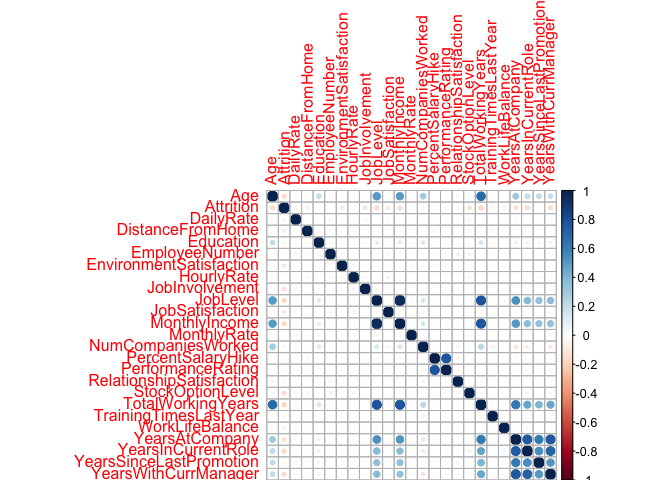

    #By segmenting the original data set into only those who have quit, we then used a scatter plot to examine job roles based on travel frequency.

By filtering the employees who have quit, we then graphed monthly
average income by amount traveled by employee and observed that the
largest group who quit were those who “Rarely traveled.” Now what does
this mean? Inconclusive.

    # plot15
    exploratory_plot15 <-ggplot(data=employee)+
      geom_point(aes(y=employee$MonthlyIncome, x=employee$TotalWorkingYears,color=JobRole))+
      labs(y="Monthly Income", x="Working Years")+
      ggtitle("Observing trend of Income VS Working Years")
    exploratory_plot15

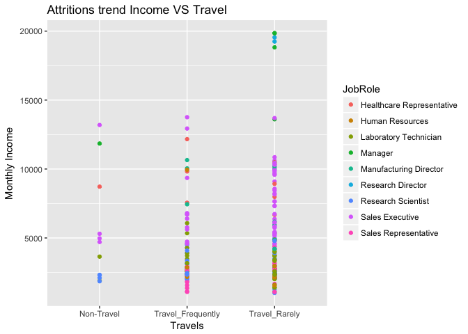

    # Created a scatter plot that used Monthly income as the y-axis and x-axis as working years faceted against job roles.

We placed working years as the x-axis and monthly income as the y-axis
to develop a visual of where certain positions lie in terms of working
year experience. As expected the more working years an employee may have
the higher the monthly income. Also with increased working years results
in higher positions such as Manager or Director.

    # plot16
    exploratory_plot16 <- ggplot(data=employee)+
      geom_point(aes(y=employee$PercentSalaryHike, x=employee$PerformanceRating))+
      labs(y="Percentage Hike", x="Performance Rating")+
      ggtitle("Attritions trend Percentage Hike VS Performance Rating")+
      facet_wrap(~Attrition)
    exploratory_plot16

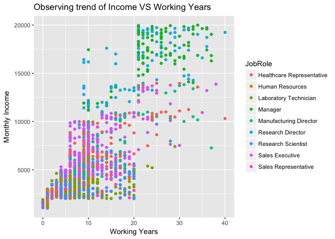

    # Created scatter plot with Percent salary hike as y-axis and Performance rating as x-axis.

Using the entire dataset we set Performance rating as the independent
variable and Performance salary hike as the dependent variable. What we
observed was that Performance rating only resulted in a rating of 3 or
4, which made an interesting find as a trend of the company but at the
same time did not provide much to conclude on.
