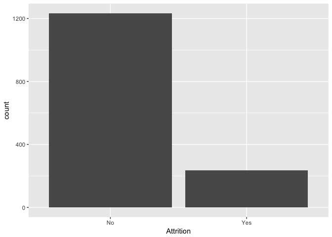

After our exploratory anlaysis, we got a sense of how correlated one
feature is to the other and created some visualisations. Based on that
result, we are going to build a predictive model on emplyee's attrition.
To start off, we will first construct some feature engineering.

    data <- read.csv('WA_Fn-UseC_-HR-Employee-Attrition.csv')

Feature engineering & Categorical Encoding
------------------------------------------

Noticing that StandardHours, Over18, EmployeeCount has only 1 demension.
We deleted these redundant features.

    data<- data[-27]
    data <- data[-22]
    data <- data[-9]

Having identified which features contain categorical data in our
dataset, we encoded those categorical variables into numerical values
for further exploration. We used model.matrix method to creates encoded
dummy variables from the categorical variables.

    dummy <- model.matrix(Attrition ~ ., data)
    new <- data.frame(dummy) # change back to a datafram 
    new <- new[,-1] # get rid first useless column
    Attrition <- data$Attrition
    dataDummy <- cbind(Attrition,new) #add Attrition back 
    head(dataDummy[,3:4]) # these are the dummy variables

    ##   BusinessTravelTravel_Frequently BusinessTravelTravel_Rarely
    ## 1                               0                           1
    ## 2                               1                           0
    ## 3                               0                           1
    ## 4                               1                           0
    ## 5                               0                           1
    ## 6                               1                           0

However after quick inspection of the counts of the number of 'Yes' and
'No' in the target variable(Attrition), we found that there is quite a
large skew in target as shown

    #check to find that the data is skewed 
    ggplot(dataDummy) + geom_histogram(aes (x = Attrition),stat = "count")

    ## Warning: Ignoring unknown parameters: binwidth, bins, pad

    prop.table(table(dataDummy$Attrition))

    ## 
    ##        No       Yes 
    ## 0.8387755 0.1612245

    table(dataDummy$Attrition)

    ## 
    ##   No  Yes 
    ## 1233  237

In this case we have to keep in mind that there is quite a big imbalance
in our target variable. And with imbalanced data sets, an algorithm
doesn’t get the necessary information about the minority class to make
an accurate prediction. In order to solve imbalanced data, we have
considered many techniques such as repeated oversampling and
undersampling. And we decided to use an oversampling technique known as
SMOTE to treat this imbalance, which will be performed in next section.

Implementing Models
===================

Having performed some exploratory data analysis and simple feature
engineering as well as having ensured that all categorical values are
encoded, we are now ready to proceed onto building our models.

### Splitting Data into Train and Test sets

Before we start training a model, we partitioned our dataset into a
training set and a test set with proportion 8:2.

    #split data into train and test 
    set.seed(1234)
    splitIndex <- createDataPartition(dataDummy$Attrition, p =0.8, list =FALSE, times =1)
    test <- dataDummy[-splitIndex,]
    train <- dataDummy[splitIndex,]

### SMOTE to oversample due to the skewness in target

Since we have already noted the severe imbalance in the values within
the target variable, we used SMOTE function to created some arbirary
data in minor class to make the whole categorical distribution in target
variable balanced. The SMOTE function oversamples your rare event by
using bootstrapping and k-nearest neighbor to synthetically create
additional observations of that event.

    #oversample train data to balance 
    trainBalance <- SMOTE(Attrition ~ ., train, perc.over = 400, perc.under=131)
    table(trainBalance$Attrition)

    ## 
    ##  No Yes 
    ## 995 950

    prop.table(table(trainBalance$Attrition))

    ## 
    ##        No       Yes 
    ## 0.5115681 0.4884319

We create some data in train set and now the proportion of "NO" "Yes" in
target variable changed from 0.84:0.16 to 0.51:0.49. We are ready to
build model based on this balanced data now.
