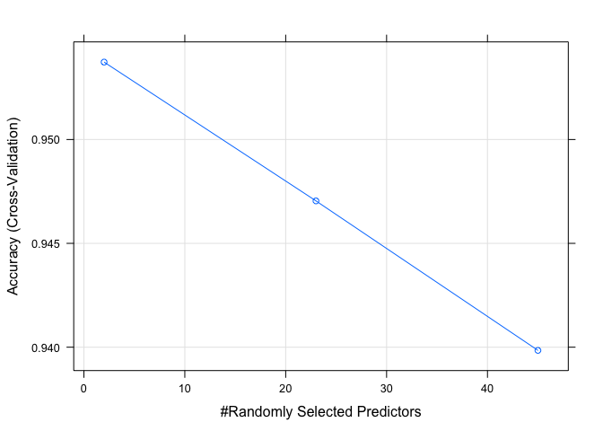
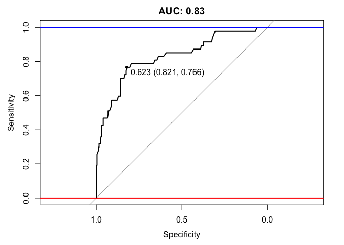
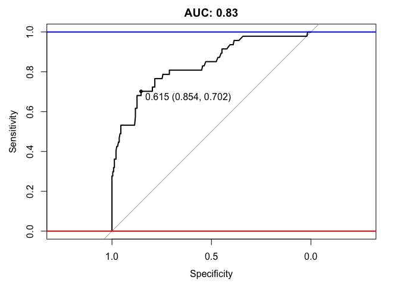

After our exploratory anlaysis, we got a sense of how correlated one
feature is to the other and created some visualisations. Based on that
result, we are going to build a predictive model on emplyee's attrition.
To start off, we will first construct some feature engineering.

    data <- read.csv('WA_Fn-UseC_-HR-Employee-Attrition.csv')

Feature engineering & Categorical Encoding
------------------------------------------

Noticing that StandardHours, Over18, EmployeeCount has only 1 demension.
We deleted these redundant features.

    data<- data[-27]
    data <- data[-22]
    data <- data[-9]

Having identified which features contain categorical data in our
dataset, we encoded those categorical variables into numerical values
for further exploration. We used model.matrix method to creates encoded
dummy variables from the categorical variables.

    dummy <- model.matrix(Attrition ~ ., data)
    new <- data.frame(dummy) # change back to a datafram 
    new <- new[,-1] # get rid first useless columne
    Attrition <- data$Attrition
    dataDummy <- cbind(Attrition,new) #add Attrition back 
    head(dataDummy)

    ##   Attrition Age BusinessTravelTravel_Frequently
    ## 1       Yes  41                               0
    ## 2        No  49                               1
    ## 3       Yes  37                               0
    ## 4        No  33                               1
    ## 5        No  27                               0
    ## 6        No  32                               1
    ##   BusinessTravelTravel_Rarely DailyRate DepartmentResearch...Development
    ## 1                           1      1102                                0
    ## 2                           0       279                                1
    ## 3                           1      1373                                1
    ## 4                           0      1392                                1
    ## 5                           1       591                                1
    ## 6                           0      1005                                1
    ##   DepartmentSales DistanceFromHome Education EducationFieldLife.Sciences
    ## 1               1                1         2                           1
    ## 2               0                8         1                           1
    ## 3               0                2         2                           0
    ## 4               0                3         4                           1
    ## 5               0                2         1                           0
    ## 6               0                2         2                           1
    ##   EducationFieldMarketing EducationFieldMedical EducationFieldOther
    ## 1                       0                     0                   0
    ## 2                       0                     0                   0
    ## 3                       0                     0                   1
    ## 4                       0                     0                   0
    ## 5                       0                     1                   0
    ## 6                       0                     0                   0
    ##   EducationFieldTechnical.Degree EmployeeNumber EnvironmentSatisfaction
    ## 1                              0              1                       2
    ## 2                              0              2                       3
    ## 3                              0              4                       4
    ## 4                              0              5                       4
    ## 5                              0              7                       1
    ## 6                              0              8                       4
    ##   GenderMale HourlyRate JobInvolvement JobLevel JobRoleHuman.Resources
    ## 1          0         94              3        2                      0
    ## 2          1         61              2        2                      0
    ## 3          1         92              2        1                      0
    ## 4          0         56              3        1                      0
    ## 5          1         40              3        1                      0
    ## 6          1         79              3        1                      0
    ##   JobRoleLaboratory.Technician JobRoleManager
    ## 1                            0              0
    ## 2                            0              0
    ## 3                            1              0
    ## 4                            0              0
    ## 5                            1              0
    ## 6                            1              0
    ##   JobRoleManufacturing.Director JobRoleResearch.Director
    ## 1                             0                        0
    ## 2                             0                        0
    ## 3                             0                        0
    ## 4                             0                        0
    ## 5                             0                        0
    ## 6                             0                        0
    ##   JobRoleResearch.Scientist JobRoleSales.Executive
    ## 1                         0                      1
    ## 2                         1                      0
    ## 3                         0                      0
    ## 4                         1                      0
    ## 5                         0                      0
    ## 6                         0                      0
    ##   JobRoleSales.Representative JobSatisfaction MaritalStatusMarried
    ## 1                           0               4                    0
    ## 2                           0               2                    1
    ## 3                           0               3                    0
    ## 4                           0               3                    1
    ## 5                           0               2                    1
    ## 6                           0               4                    0
    ##   MaritalStatusSingle MonthlyIncome MonthlyRate NumCompaniesWorked
    ## 1                   1          5993       19479                  8
    ## 2                   0          5130       24907                  1
    ## 3                   1          2090        2396                  6
    ## 4                   0          2909       23159                  1
    ## 5                   0          3468       16632                  9
    ## 6                   1          3068       11864                  0
    ##   OverTimeYes PercentSalaryHike PerformanceRating RelationshipSatisfaction
    ## 1           1                11                 3                        1
    ## 2           0                23                 4                        4
    ## 3           1                15                 3                        2
    ## 4           1                11                 3                        3
    ## 5           0                12                 3                        4
    ## 6           0                13                 3                        3
    ##   StockOptionLevel TotalWorkingYears TrainingTimesLastYear WorkLifeBalance
    ## 1                0                 8                     0               1
    ## 2                1                10                     3               3
    ## 3                0                 7                     3               3
    ## 4                0                 8                     3               3
    ## 5                1                 6                     3               3
    ## 6                0                 8                     2               2
    ##   YearsAtCompany YearsInCurrentRole YearsSinceLastPromotion
    ## 1              6                  4                       0
    ## 2             10                  7                       1
    ## 3              0                  0                       0
    ## 4              8                  7                       3
    ## 5              2                  2                       2
    ## 6              7                  7                       3
    ##   YearsWithCurrManager
    ## 1                    5
    ## 2                    7
    ## 3                    0
    ## 4                    0
    ## 5                    2
    ## 6                    6

However after quick inspection of the counts of the number of 'Yes' and
'No' in the target variable(Attrition), we found that there is quite a
large skew in target as shown

    #check to find that the data is skewed 
    ggplot(dataDummy) + geom_histogram(aes (x = Attrition),stat = "count")

    ## Warning: Ignoring unknown parameters: binwidth, bins, pad

    prop.table(table(dataDummy$Attrition))

    ## 
    ##        No       Yes 
    ## 0.8387755 0.1612245

    table(dataDummy$Attrition)

    ## 
    ##   No  Yes 
    ## 1233  237

In this case we have to keep in mind that there is quite a big imbalance
in our target variable. And with imbalanced data sets, an algorithm
doesn’t get the necessary information about the minority class to make
an accurate prediction. In order to solve imbalanced data, we have
considered many techniques such as repeated oversampling and
undersampling. And we decided to use an oversampling technique known as
SMOTE to treat this imbalance, which will be performed in next section.

Implementing Models
-------------------

Having performed some exploratory data analysis and simple feature
engineering as well as having ensured that all categorical values are
encoded, we are now ready to proceed onto building our models.

Splitting Data into Train and Test sets
=======================================

Before we start training a model, we partitioned our dataset into a
training set and a test set with proportion 8:2.

    #split data into train and test 
    set.seed(1234)
    splitIndex <- createDataPartition(dataDummy$Attrition, p =0.8, list =FALSE, times =1)
    test <- dataDummy[-splitIndex,]
    train <- dataDummy[splitIndex,]

SMOTE to oversample due to the skewness in target
=================================================

Since we have already noted the severe imbalance in the values within
the target variable, we used SMOTE function to created some arbirary
data in minor class to make the whole categorical distribution in target
variable balanced. The SMOTE function oversamples your rare event by
using bootstrapping and k-nearest neighbor to synthetically create
additional observations of that event.

    #oversample train data to balance 
    trainBalance <- SMOTE(Attrition ~ ., train, perc.over = 400, perc.under=131)
    table(trainBalance$Attrition)

    ## 
    ##  No Yes 
    ## 995 950

    prop.table(table(trainBalance$Attrition))

    ## 
    ##        No       Yes 
    ## 0.5115681 0.4884319

We create some data in train set and now the proportion of "NO" "Yes" in
target variable changed from 0.84:0.16 to 0.51:0.49. We are ready to
build model based on this balanced data now.

Random Forest Classifier
------------------------

Since all interested in decidsion trees. We'll build an Random Forest
Classifier to predict employees' attrition without lossing any
variables. From Wikipedia, Random forests are an ensemble learning
method for classification, regression and other tasks, that operate by
constructing a multitude of decision trees at training time and
outputting the class that is the mode of the classes (classification) or
mean prediction (regression) of the individual trees. We will first
train such a model by using default tuning parametsrs from caret
package.

### Train model with default setting

    library(caret)
    set.seed(1234) #set seed to reproducible 
    ctrl <- trainControl(method = "cv", number = 5)
    rf_model <- train(Attrition~., data = trainBalance, method = "rf", trControl =ctrl)
    print(rf_model)

    ## Random Forest 
    ## 
    ## 1945 samples
    ##   45 predictor
    ##    2 classes: 'No', 'Yes' 
    ## 
    ## No pre-processing
    ## Resampling: Cross-Validated (5 fold) 
    ## Summary of sample sizes: 1556, 1556, 1556, 1556, 1556 
    ## Resampling results across tuning parameters:
    ## 
    ##   mtry  Accuracy   Kappa    
    ##    2    0.9537275  0.9072924
    ##   23    0.9470437  0.8938917
    ##   45    0.9398458  0.8794729
    ## 
    ## Accuracy was used to select the optimal model using  the largest value.
    ## The final value used for the model was mtry = 2.

    plot(rf_model)

We chose the optimal model base on highest accuray, this model has
mtry(Number of variables randomly sampled as candidates at each split)
euqals to 2.

Having fitted our forest of trees with our parameters to the training
set against our target variable, we now have a learning model
"rf\_model" which we can make predictions out of. Our next step is to
make predictions by using this model.

    predictors <- names(trainBalance)[names(trainBalance) != 'Attrition']
    pred_rf <- predict(rf_model$finalModel, test[,predictors],type = "prob")

    #use AUC to measure the prediction 
    auc <- roc(test$Attrition, pred_rf[,1])
    print(auc)

    ## 
    ## Call:
    ## roc.default(response = test$Attrition, predictor = pred_rf[,     1])
    ## 
    ## Data: pred_rf[, 1] in 246 controls (test$Attrition No) > 47 cases (test$Attrition Yes).
    ## Area under the curve: 0.8275

    plot(auc, ylim=c(0,1), print.thres=TRUE, main=paste('AUC:',round(auc$auc[[1]],2)))
    abline(h=1,col='blue',lwd=2)
    abline(h=0,col='red',lwd=2)

Accuracy of the model: We use AUC(area under the curve) to measure the
prediction results. As observed, our Random Forest returns an AUC of
0.8435 for its predictions. On first glance this might seem to be a very
good performing model. From the AUC graph we can also find that the line
quickly goes to 0.6, which means 60% class is easy to predict. Then the
growth rate turned slow and hardly reached 1, meaning the last 10% class
is hard to predict.

### Tuning parameters

To further explore more, we tryied to tune the parameters in random
forest model to see if we can find a better model. We focused on the
below two parameters since they are most likely to have the biggest
effect on your final accuracy. mtry: Number of variables randomly
sampled as candidates at each split. ntree: Number of trees to grow.
Unfortunately, only mtry parameter is available in caret package for
tuning. Normally the larger ntree parameter the better the model, but
when the number is big enough it's effect decrease. We noticed that in
caret packge the ntree parameter is 500. We guess that's a farily high
number to make the model accurate. In order to tune the mtry parameter,
we found that there are two ways to tune the mtry parameter: - Random
Search: try random values within a range. - Grid Search: define a grid
of algorithm parameters to try. We performed grid search by setting mtry
=c(1:23). The result based on training accuracy gives us the optimal
model when mtry =3.

    #grid search
    control <- trainControl(method="repeatedcv", number=10, repeats=3, search="grid")
    set.seed(1234)
    #since the ideal mtry is between sqrtq to 2/q.
    tunegrid <- expand.grid(.mtry=c(1:23))
    #tunegrid <- expand.grid(.mtry=8)
    rf_gridsearch <- train(Attrition~., data=trainBalance, method="rf", metric="Accuracy", tuneGrid=tunegrid, trControl=control)
    print(rf_gridsearch)
    plot(rf_gridsearch)

From the graph, we can see mtry = 3 has the optimum model using the
largest value.

    control <- trainControl(method="repeatedcv", number=10, repeats=3)
    set.seed(1234)
    tunegrid <- expand.grid(.mtry= 3)
    rf_optimal <- train(Attrition~., data=trainBalance, method="rf", metric="Accuracy", tuneGrid=tunegrid, trControl=control)
    rf_optimal

    ## Random Forest 
    ## 
    ## 1945 samples
    ##   45 predictor
    ##    2 classes: 'No', 'Yes' 
    ## 
    ## No pre-processing
    ## Resampling: Cross-Validated (10 fold, repeated 3 times) 
    ## Summary of sample sizes: 1751, 1750, 1751, 1751, 1750, 1750, ... 
    ## Resampling results:
    ## 
    ##   Accuracy   Kappa    
    ##   0.9583488  0.9165736
    ## 
    ## Tuning parameter 'mtry' was held constant at a value of 3

    predictors <- names(trainBalance)[names(trainBalance) != 'Attrition']
    predictors

    ##  [1] "Age"                              "BusinessTravelTravel_Frequently" 
    ##  [3] "BusinessTravelTravel_Rarely"      "DailyRate"                       
    ##  [5] "DepartmentResearch...Development" "DepartmentSales"                 
    ##  [7] "DistanceFromHome"                 "Education"                       
    ##  [9] "EducationFieldLife.Sciences"      "EducationFieldMarketing"         
    ## [11] "EducationFieldMedical"            "EducationFieldOther"             
    ## [13] "EducationFieldTechnical.Degree"   "EmployeeNumber"                  
    ## [15] "EnvironmentSatisfaction"          "GenderMale"                      
    ## [17] "HourlyRate"                       "JobInvolvement"                  
    ## [19] "JobLevel"                         "JobRoleHuman.Resources"          
    ## [21] "JobRoleLaboratory.Technician"     "JobRoleManager"                  
    ## [23] "JobRoleManufacturing.Director"    "JobRoleResearch.Director"        
    ## [25] "JobRoleResearch.Scientist"        "JobRoleSales.Executive"          
    ## [27] "JobRoleSales.Representative"      "JobSatisfaction"                 
    ## [29] "MaritalStatusMarried"             "MaritalStatusSingle"             
    ## [31] "MonthlyIncome"                    "MonthlyRate"                     
    ## [33] "NumCompaniesWorked"               "OverTimeYes"                     
    ## [35] "PercentSalaryHike"                "PerformanceRating"               
    ## [37] "RelationshipSatisfaction"         "StockOptionLevel"                
    ## [39] "TotalWorkingYears"                "TrainingTimesLastYear"           
    ## [41] "WorkLifeBalance"                  "YearsAtCompany"                  
    ## [43] "YearsInCurrentRole"               "YearsSinceLastPromotion"         
    ## [45] "YearsWithCurrManager"

    pred_rf_gridsearch <- predict(rf_optimal$finalModel,test[,predictors],type = "prob")
    pred_rf_gridsearch

    ##         No   Yes
    ## 7    0.560 0.440
    ## 21   0.836 0.164
    ## 26   0.926 0.074
    ## 28   0.854 0.146
    ## 35   0.512 0.488
    ## 49   0.522 0.478
    ## 52   0.394 0.606
    ## 60   0.840 0.160
    ## 64   0.712 0.288
    ## 66   0.870 0.130
    ## 67   0.668 0.332
    ## 71   0.550 0.450
    ## 72   0.860 0.140
    ## 73   0.548 0.452
    ## 81   0.710 0.290
    ## 83   0.696 0.304
    ## 84   0.784 0.216
    ## 85   0.730 0.270
    ## 91   0.876 0.124
    ## 100  0.764 0.236
    ## 107  0.720 0.280
    ## 113  0.802 0.198
    ## 114  0.718 0.282
    ## 120  0.792 0.208
    ## 124  0.808 0.192
    ## 127  0.746 0.254
    ## 134  0.738 0.262
    ## 144  0.540 0.460
    ## 145  0.782 0.218
    ## 148  0.858 0.142
    ## 150  0.484 0.516
    ## 151  0.884 0.116
    ## 154  0.792 0.208
    ## 156  0.854 0.146
    ## 159  0.738 0.262
    ## 170  0.636 0.364
    ## 173  0.728 0.272
    ## 185  0.836 0.164
    ## 188  0.810 0.190
    ## 197  0.802 0.198
    ## 198  0.874 0.126
    ## 203  0.544 0.456
    ## 205  0.614 0.386
    ## 215  0.454 0.546
    ## 223  0.698 0.302
    ## 232  0.826 0.174
    ## 236  0.810 0.190
    ## 244  0.846 0.154
    ## 248  0.876 0.124
    ## 252  0.764 0.236
    ## 261  0.554 0.446
    ## 267  0.848 0.152
    ## 268  0.798 0.202
    ## 286  0.822 0.178
    ## 296  0.752 0.248
    ## 308  0.778 0.222
    ## 327  0.856 0.144
    ## 332  0.668 0.332
    ## 335  0.858 0.142
    ## 340  0.812 0.188
    ## 348  0.502 0.498
    ## 349  0.792 0.208
    ## 360  0.710 0.290
    ## 361  0.864 0.136
    ## 367  0.654 0.346
    ## 370  0.398 0.602
    ## 375  0.752 0.248
    ## 378  0.864 0.136
    ## 387  0.836 0.164
    ## 392  0.720 0.280
    ## 393  0.878 0.122
    ## 401  0.830 0.170
    ## 415  0.320 0.680
    ## 418  0.882 0.118
    ## 421  0.738 0.262
    ## 422  0.416 0.584
    ## 423  0.286 0.714
    ## 430  0.788 0.212
    ## 434  0.706 0.294
    ## 453  0.794 0.206
    ## 479  0.548 0.452
    ## 482  0.620 0.380
    ## 493  0.908 0.092
    ## 494  0.662 0.338
    ## 497  0.476 0.524
    ## 501  0.708 0.292
    ## 509  0.762 0.238
    ## 513  0.650 0.350
    ## 522  0.756 0.244
    ## 523  0.658 0.342
    ## 524  0.736 0.264
    ## 526  0.596 0.404
    ## 533  0.754 0.246
    ## 537  0.550 0.450
    ## 538  0.862 0.138
    ## 542  0.762 0.238
    ## 548  0.500 0.500
    ## 552  0.844 0.156
    ## 553  0.798 0.202
    ## 559  0.800 0.200
    ## 566  0.594 0.406
    ## 568  0.780 0.220
    ## 569  0.908 0.092
    ## 571  0.852 0.148
    ## 582  0.772 0.228
    ## 603  0.582 0.418
    ## 609  0.782 0.218
    ## 614  0.794 0.206
    ## 619  0.500 0.500
    ## 621  0.612 0.388
    ## 632  0.618 0.382
    ## 633  0.570 0.430
    ## 637  0.590 0.410
    ## 639  0.624 0.376
    ## 643  0.658 0.342
    ## 653  0.570 0.430
    ## 655  0.850 0.150
    ## 658  0.646 0.354
    ## 662  0.626 0.374
    ## 670  0.484 0.516
    ## 677  0.732 0.268
    ## 684  0.260 0.740
    ## 688  0.804 0.196
    ## 689  0.136 0.864
    ## 699  0.780 0.220
    ## 701  0.582 0.418
    ## 703  0.708 0.292
    ## 712  0.308 0.692
    ## 719  0.798 0.202
    ## 724  0.904 0.096
    ## 728  0.546 0.454
    ## 730  0.770 0.230
    ## 732  0.282 0.718
    ## 753  0.788 0.212
    ## 754  0.724 0.276
    ## 759  0.696 0.304
    ## 760  0.686 0.314
    ## 761  0.732 0.268
    ## 768  0.662 0.338
    ## 771  0.896 0.104
    ## 778  0.370 0.630
    ## 784  0.802 0.198
    ## 789  0.772 0.228
    ## 790  0.772 0.228
    ## 799  0.266 0.734
    ## 807  0.786 0.214
    ## 812  0.610 0.390
    ## 813  0.792 0.208
    ## 816  0.428 0.572
    ## 818  0.814 0.186
    ## 820  0.626 0.374
    ## 827  0.764 0.236
    ## 829  0.376 0.624
    ## 832  0.740 0.260
    ## 837  0.794 0.206
    ## 840  0.708 0.292
    ## 843  0.472 0.528
    ## 844  0.786 0.214
    ## 846  0.530 0.470
    ## 852  0.936 0.064
    ## 853  0.850 0.150
    ## 863  0.608 0.392
    ## 864  0.758 0.242
    ## 868  0.928 0.072
    ## 871  0.710 0.290
    ## 874  0.782 0.218
    ## 875  0.834 0.166
    ## 877  0.472 0.528
    ## 878  0.874 0.126
    ## 888  0.636 0.364
    ## 894  0.826 0.174
    ## 900  0.790 0.210
    ## 912  0.198 0.802
    ## 922  0.380 0.620
    ## 926  0.674 0.326
    ## 931  0.616 0.384
    ## 936  0.830 0.170
    ## 937  0.688 0.312
    ## 938  0.816 0.184
    ## 941  0.674 0.326
    ## 948  0.322 0.678
    ## 960  0.836 0.164
    ## 972  0.716 0.284
    ## 974  0.800 0.200
    ## 977  0.810 0.190
    ## 983  0.814 0.186
    ## 984  0.816 0.184
    ## 989  0.724 0.276
    ## 993  0.868 0.132
    ## 1004 0.688 0.312
    ## 1005 0.626 0.374
    ## 1006 0.608 0.392
    ## 1009 0.880 0.120
    ## 1013 0.264 0.736
    ## 1016 0.768 0.232
    ## 1018 0.650 0.350
    ## 1025 0.828 0.172
    ## 1029 0.576 0.424
    ## 1030 0.826 0.174
    ## 1044 0.818 0.182
    ## 1052 0.642 0.358
    ## 1053 0.642 0.358
    ## 1058 0.424 0.576
    ## 1073 0.794 0.206
    ## 1075 0.592 0.408
    ## 1076 0.774 0.226
    ## 1082 0.746 0.254
    ## 1084 0.598 0.402
    ## 1088 0.696 0.304
    ## 1093 0.812 0.188
    ## 1098 0.420 0.580
    ## 1101 0.770 0.230
    ## 1114 0.856 0.144
    ## 1119 0.690 0.310
    ## 1126 0.768 0.232
    ## 1130 0.752 0.248
    ## 1131 0.888 0.112
    ## 1132 0.710 0.290
    ## 1133 0.846 0.154
    ## 1134 0.744 0.256
    ## 1143 0.626 0.374
    ## 1150 0.778 0.222
    ## 1153 0.616 0.384
    ## 1168 0.518 0.482
    ## 1169 0.440 0.560
    ## 1170 0.684 0.316
    ## 1171 0.662 0.338
    ## 1176 0.730 0.270
    ## 1177 0.872 0.128
    ## 1179 0.488 0.512
    ## 1182 0.892 0.108
    ## 1185 0.870 0.130
    ## 1196 0.884 0.116
    ## 1201 0.664 0.336
    ## 1202 0.496 0.504
    ## 1210 0.806 0.194
    ## 1224 0.692 0.308
    ## 1237 0.582 0.418
    ## 1245 0.628 0.372
    ## 1246 0.682 0.318
    ## 1247 0.644 0.356
    ## 1248 0.800 0.200
    ## 1249 0.782 0.218
    ## 1253 0.718 0.282
    ## 1259 0.560 0.440
    ## 1260 0.798 0.202
    ## 1261 0.552 0.448
    ## 1264 0.734 0.266
    ## 1274 0.454 0.546
    ## 1288 0.718 0.282
    ## 1296 0.734 0.266
    ## 1298 0.586 0.414
    ## 1303 0.784 0.216
    ## 1305 0.862 0.138
    ## 1324 0.840 0.160
    ## 1325 0.794 0.206
    ## 1326 0.610 0.390
    ## 1328 0.826 0.174
    ## 1337 0.780 0.220
    ## 1339 0.424 0.576
    ## 1343 0.702 0.298
    ## 1348 0.730 0.270
    ## 1349 0.920 0.080
    ## 1353 0.782 0.218
    ## 1356 0.716 0.284
    ## 1358 0.890 0.110
    ## 1368 0.728 0.272
    ## 1372 0.748 0.252
    ## 1374 0.798 0.202
    ## 1376 0.342 0.658
    ## 1377 0.834 0.166
    ## 1382 0.696 0.304
    ## 1383 0.566 0.434
    ## 1385 0.670 0.330
    ## 1387 0.684 0.316
    ## 1390 0.740 0.260
    ## 1391 0.654 0.346
    ## 1393 0.780 0.220
    ## 1407 0.766 0.234
    ## 1410 0.736 0.264
    ## 1421 0.866 0.134
    ## 1422 0.878 0.122
    ## 1424 0.742 0.258
    ## 1441 0.790 0.210
    ## 1445 0.768 0.232
    ## 1448 0.794 0.206
    ## 1450 0.688 0.312
    ## 1452 0.834 0.166
    ## 1453 0.776 0.224
    ## 1456 0.726 0.274
    ## 1457 0.724 0.276
    ## 1462 0.606 0.394
    ## 1464 0.746 0.254
    ## attr(,"class")
    ## [1] "matrix" "votes"

    auc <- roc(test$Attrition, pred_rf_gridsearch[,1])
    print(auc)

    ## 
    ## Call:
    ## roc.default(response = test$Attrition, predictor = pred_rf_gridsearch[,     1])
    ## 
    ## Data: pred_rf_gridsearch[, 1] in 246 controls (test$Attrition No) > 47 cases (test$Attrition Yes).
    ## Area under the curve: 0.8332

    plot(auc, ylim=c(0,1), print.thres=TRUE, main=paste('AUC:',round(auc$auc[[1]],2)))
    abline(h=1,col='blue',lwd=2)
    abline(h=0,col='red',lwd=2)

After tuning parameter mtry we updated our model from using mtry =2 to
mtry =3, which gives us a better AUC from original 0.8435 to 0.8437.
There is no huge difference between these two models.

### Feature selection

    #since the best mtry = 3
    importance_grid <- varImp(rf_gridsearch,scale = FALSE)
    print(importance_grid)
    plot(importance_grid)

We're suprised that marital status are not in the first 20 importance.
It may because marital status has high correlation with other
features(such as Age). We can also reflect back to the correlation
analysis we made in Data Exploratory Analysis

### Building model based on selected data

    slData <- data[, c("OverTime", "StockOptionLevel","TotalWorkingYears",
    "MonthlyIncome","JobInvolvement","Age","EnvironmentSatisfaction", "JobSatisfaction",
    "YearsWithCurrManager","YearsAtCompany","JobLevel","YearsInCurrentRole",
    "DailyRate","EmployeeNumber","TrainingTimesLastYear","DistanceFromHome","Education",
    "NumCompaniesWorked","HourlyRate","WorkLifeBalance")]
